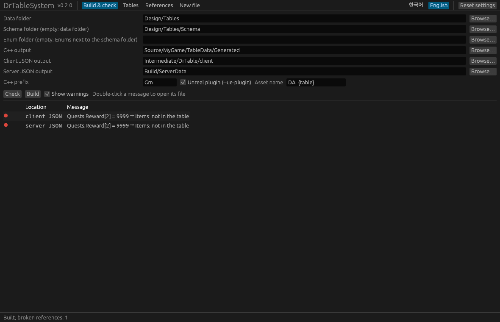
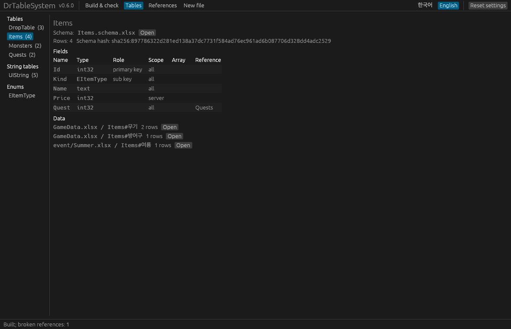
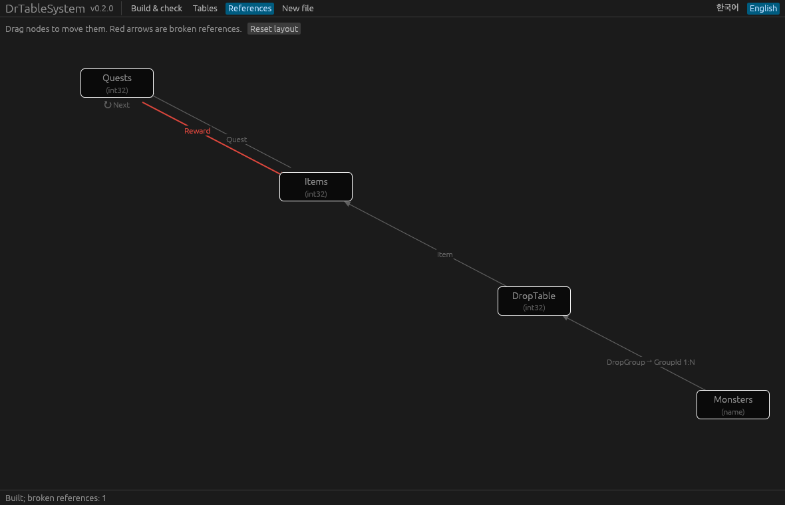

# DrTableSystem manual

DrTableSystem (DesignToRuntime Table System) carries the data designers write in spreadsheets all the way to the game runtime. It keeps a table's **structure (schema)** apart from its **data**, and produces:

- **Unreal C++**: `USTRUCT` row types, `UENUM` enums, one DataAsset class per table, and optionally typed lookup functions and a registration header. **Generated from the schemas only**, so data edits never change code.
- **Client JSON**: the rows a game client needs, plus prebuilt key indices, ready to be baked into DataAssets.
- **Server JSON**: the rows a server needs (server-only fields included, client-only fields excluded).

The **DrTableSystem Unreal plugin** bakes the client JSON into DataAssets, loads them at runtime without copying or building indices, and detects stale assets.

```
Schemas (Schema/*.schema.xlsx, Enums/*.enum.xlsx) ─┐                 ┌─▶ C++ headers ─────────────▶ compile
                                                      ├▶ drtable build ─┼─▶ client JSON ─▶ DrTableBake ─▶ DA_*.uasset ─▶ runtime lookups
Data workbooks (*.xlsx: field names in row 1, data) ──┘                 └─▶ server JSON ─▶ your server
                 drtable check  ◀─ client/server JSON  (reference integrity, CI)
                 drtable graph  ─▶ references.md       (Mermaid diagram)
```

| Who | Edits | Effect |
|---|---|---|
| Programmers | schemas (fields, types, scopes, enum values) | code changes → reviewed |
| Designers | data workbooks (values, rows, splitting into files and sheets) | only JSON and assets change; code stays the same |

Contents

1. [Installation](#1-installation)
2. [Schemas and data](#2-schemas-and-data)
3. [Types](#3-types)
4. [Keys and defaults](#4-keys-and-defaults)
5. [Arrays](#5-arrays)
6. [Enums](#6-enums)
7. [References between tables](#7-references-between-tables)
8. [Outputs](#8-outputs)
9. [Command line](#9-command-line)
10. [Unreal plugin](#10-unreal-plugin)
11. [Change detection: schema hash and content hash](#11-change-detection-schema-hash-and-content-hash)
12. [Lookup correctness rules](#12-lookup-correctness-rules)
13. [CI](#13-ci)
14. [Troubleshooting](#14-troubleshooting)

---

## 1. Installation

`drtable` is **a single executable with nothing to install**. Download the archive for your platform from GitHub Releases (Windows `x86_64-pc-windows-msvc`, macOS `aarch64-apple-darwin`, Linux `x86_64-unknown-linux-gnu`) and put `drtable` (command line) and `drtable-gui` (window, section 9) wherever you like (`.exe` on Windows). For a team, commit it to the project repository (for example `Tools/DrTable/drtable.exe`) so that syncing the repository is all anyone needs.

```sh
drtable --version
```

To build it yourself you need [Rust](https://rustup.rs/):

```sh
cd rust
cargo build --release                                  # rust/target/release/drtable
cargo build --release --features gui --bin drtable-gui  # rust/target/release/drtable-gui
```

`src/drtable` in the repository is a Python reference implementation of the same behaviour. The tests compare both implementations byte for byte (section 13).

For Unreal, copy `unreal/DrTableSystem` into your project's `Plugins/` folder ([section 10](#10-unreal-plugin)). The plugin is developed and tested with Unreal Engine 5.8.

Messages are in English by default. Pass `--lang ko` or set `DRTABLE_LANG=ko` for Korean. Generated files are always in English.

## 2. Schemas and data

### Folder layout

```
Design/Tables/                    ← --input (data)
  Items.xlsx
  Monsters.xlsx
  event/Summer.xlsx               ← subfolders are read too
  Schema/                         ← --schema (table schemas)
    Items.schema.xlsx
    Monsters.schema.xlsx
  Enums/                          ← --enums (enum schemas, default: Enums next to the schema folder)
    ItemType.enum.xlsx
```

- One schema file per table, and one file per enum in the enum folder. The file name must match the name it defines (`Items.schema.xlsx` ↔ table `Items`).
- The enum folder sits **next to** the table schema folder. Without `--enums`, `Enums` next to the schema folder is used (`Table/Schema` → `Table/Enums`).
- Without `--schema`, `*.schema.xlsx` files are looked up anywhere under the input folder and the enum folder is `Enums` inside it. Schema files are skipped when reading data.
- Excel lock files (`~$…`) and hidden folders (starting with `.`) are skipped.

### Schema files

`Items.schema.xlsx`: one sheet named after the table. Row 1 holds labels; from row 2, one field per row.

| | A Field | B Type | C Scope | D Comment |
|---|---|---|---|---|
| **1** | `Field` | `Type` | `Scope` | `Comment` |
| **2** | `Id` | `ID<int32>` | `all` | |
| **3** | `Name` | `SubKey<name>` | `all` | display name |
| **4** | `Element` | `SubKey<EElement>` | `all` | |
| **5** | `Damage` | `float=0` | `client` | damage per second |

- **Type** may carry a key role or a default: `int32`, `ID<int32>`, `SubKey<name>`, `float=1.0` (sections 3 and 4).
- **Scope**: `all` both, `client` client only, `server` server only, `#` comment (excluded everywhere). Case-insensitive.
- Field order is the member order of the C++ struct.

### Data workbooks

| Row | Content |
|---|---|
| 1 | Field names. The build finds the schema's fields by these names. |
| 2-3 | For reference (type and scope). **The build never reads them.** Usually formulas that show the schema (see reference headers below). |
| 4+ | Data |

- **The sheet name is the table name.** Sheets starting with `#` are notes, and text from a `#` inside a name is a comment (`Items#Weapons` is table `Items`).
- **Column order is free** and may differ from the schema.
- Columns whose row-1 name starts with `#` are notes. An empty name in row 1 ends the header; columns to its right are not read. Rows whose data cells are all empty are skipped.
- A name that is not in the schema, a missing field and a duplicate name are errors. **Fields are added in the schema.**
- A table that has a schema but no data sheet is generated with zero rows.

### Reference headers

Rows 2 and 3 of a data sheet hold formulas that look up each row-1 field name in the table's schema spreadsheet and show its type and scope, so schema changes show up when the workbook is opened. `drtable new --table Items --out Design/Tables/Items.xlsx --schema Design/Tables/Schema` creates a **new** data workbook with these formulas.

```
row 2: =IFERROR(INDEX('[1]Items'!$B:$B,MATCH(A$1,'[1]Items'!$A:$A,0)),"(not in schema)")
```

- When you add a column, drag the formulas from the next column. Unknown names show `(not in schema)`.
- The tool **never changes existing data workbooks** (designers may be editing them). To add the formulas to one, copy rows 2-3 from a workbook made by `drtable new`.
- If Excel warns about external links when opening, choose "Enable Content", or add the data folder to Excel's **Trusted Locations**.

**Link paths.** Excel keeps a link relative only when the schema file sits in the data workbook's **folder or below it**. Otherwise (for example data in `event/` and schemas in `Schema/` next to it) the link stores the absolute path of whoever saved the workbook, and someone who checked out the repository elsewhere keeps seeing the values from that save even after the schema changes. This never affects the build, and the build reports such workbooks (`the reference headers link to a path that does not exist here`). Fix the link in Excel (Data → Edit Links → Change Source) or paste rows 2-3 again from a workbook made by `drtable new`. Teams that check out to the same path never hit this.

### Split tables

A large table, or one several people maintain, can be split over several sheets and files. Every sheet whose **table name** (the sheet name without its `#` comment) is the same belongs to one table, and all of them follow the same schema.

```
Design/Tables/
  Items.xlsx           sheets Items#Weapons, Items#Armor
  event/Summer.xlsx    sheet  Items#Summer event
```

- Duplicate primary keys and name keys differing only by case are checked across all sheets, and the error names both places, for example `[event/Summer.xlsx]Items#Summer event!A5: duplicate primary key '3' (first at [Items.xlsx]Items#Weapons!A4)`.
- Rows are sorted by primary key, so the output is the same as for the unsplit table.
- The manifest records which files and sheets hold each table's data (`sources`, section 8).

### Locations

Every error message starts with a `[File]Sheet!Cell` location, e.g. `[Items.xlsx]Items!A7`, `[Items.schema.xlsx]Items!B4`.

File paths are relative to the input folder (data) or the schema folder.

## 3. Types

| Type | C++ | Client JSON | Server JSON |
|---|---|---|---|
| `int32`, `int64` | `int32`, `int64` | number | number |
| `float`, `double` | `float`, `double` | number | number |
| `bool` | `bool` | true/false | true/false |
| `name` | `FName` | string | string |
| `string` | `FString` | string | string |
| `text` | `FText` | string | string |
| `tag` | `FGameplayTag` | string | string |
| `path` | `FSoftObjectPath` | string | string |
| `E<Enum>` | `E<Prefix><Enum>` | enumerator name | enumerator name |
| `Ref<Table>` / `Ref<Table.SubKey>` | type of the target key | same as the target | same as the target |

- The server is not assumed to be Unreal: `name`, `string`, `text`, `tag` and `path` are plain strings in server JSON.
- `path` is always an untyped `FSoftObjectPath`. Convert with `TSoftObjectPtr<T>(Path)` at runtime when you need a typed pointer.
- `bool` accepts TRUE/FALSE, 1/0 and the strings `true`/`false`.
- Nested structs are not supported; use arrays (section 5) or references to other tables (section 7).

## 4. Keys and defaults

- **Primary key** `ID<type>`: exactly one per table, scope must be `all`, values must be unique and non-empty.
- **Sub keys** `SubKey<type>`: any number. Each gets a prebuilt index, so "all rows whose `Element` is `Fire`" is a binary search instead of a scan. Values may repeat.
- Key types are limited to `int32`, `int64`, `name` and enums. Floating point comparisons are unstable, `bool` is meaningless as a key, and `string`/`text`/`tag`/`path` have no comparison that matches the generator's ordering.
- **Defaults**: `float=1.0`, `bool=true`, `string=none`. Empty cells take the declared default, otherwise the type default (0, false, empty, first enumerator). Keys cannot have defaults.

## 5. Arrays

In a schema, fields numbered `Field[0]`, `Field[1]`, … form one fixed-size array field. Data workbooks use the same names (`Reward[0]`, …) in row 1.

| Field | Type | Scope |
|---|---|---|
| `Id` | `ID<int32>` | `all` |
| `Reward[0]` | `int32` | `all` |
| `Reward[1]` | `int32` | `all` |
| `Reward[2]` | `int32` | `all` |

- C++: a C-style array, `int32 Reward[3] = {};`, stored inline in the row with no heap allocation.
- JSON: a real array, `"Reward": [10, 20, 30]`.
- Indices must start at 0 without gaps, and all elements must share type and scope. Arrays cannot be keys.
- Unreal cannot expose C-style arrays to Blueprint, so array properties are `EditAnywhere` only.
- Each element may declare its own default (`int32=10`, `int32=20`).

## 6. Enums

An enum's values become a C++ `UENUM`, so they **belong to the schema**. Each enum is one file in the enum folder (default: `Enums` next to the schema folder).

`Enums/ItemType.enum.xlsx`, sheet `ItemType`:

| | A Name | B Value | C Comment |
|---|---|---|---|
| **1** | `Name` | `Value` | `Comment` |
| **2** | `Weapon` | `0` | swords, bows |
| **3** | `Armor` | | helmets, armor |

- Values are optional (the first is 0, then previous + 1). They must fit in uint8 and be unique.
- Comments become comments in the generated code.
- Tables use the enum as `E<Name>` (`EItemType`).
- Enums cannot be split; defining the same name twice is an error.
- **Per-enumerator data** (display names, icons, …) is an ordinary table keyed by the enum, for example `ItemTypeInfo.schema.xlsx` with `Id: ID<EItemType>`, `DisplayName: text`, … and an `ItemTypeInfo` data sheet.

## 7. References between tables

A `Ref<Items>` field holds a primary key value of table `Items`. Its actual type is the type of the target key, so changing that key type changes the reference field too.

```
Quests:   Id: ID<int32>   RewardItem: Ref<Items>   Next[0]: Ref<Quests>   Next[1]: Ref<Quests>
```

- **An empty cell means "no reference"**: `0` for numeric keys, an empty name for `name` keys. References to an enum-keyed table cannot be empty (an enum has no "none" value).
- Self references and cycles between tables are allowed. Arrays and `SubKey<Ref<...>>` work. `ID<Ref<...>>` and defaults on references do not.

**Sub key references.** `Ref<DropTable.GroupId>` points at every row whose sub key `GroupId` has that value: one value, many rows (1:N).

```
Monsters:   Id: ID<name>        DropGroup: Ref<DropTable.GroupId>
DropTable:  Id: ID<int32>       GroupId: SubKey<int32>      Item: Ref<Items>
```

- The field after the dot must be declared `SubKey<>` (it needs an index). Use `Ref<Table>` for the primary key.
- A reference field cannot have a wider scope than the sub key it targets; an `all` field pointing at a `client`-only sub key could not be checked in the server output.
- When the target sub key is itself a reference, types are resolved along the chain. Cycles that can never resolve are reported with the full path.

**Validation.** `build` checks the schema only (the target exists, types resolve). Whether each value exists is checked on the generated JSON by `drtable check` (section 9). Generated C++ carries `meta = (TableRef = "Items")` (plus `TableRefKey = "GroupId"` for sub key references) so editor tools can follow references.

## 8. Outputs

### C++

```
<out-cpp>/EDtElement.h          one per enum
<out-cpp>/DtEffectsRow.h        row struct per table
<out-cpp>/DtEffectsTable.h      DataAsset class per table
<out-cpp>/DtGeneratedTables.h   name, key and schema hash constants
```

With `--runtime-header` (or `--ue-plugin`) also:

```
<out-cpp>/DtEffectsRow.cpp        lookup and reference function definitions
<out-cpp>/DtTableRegistration.h   DtGeneratedTables::RegisterAll(Registry)
```

- Row struct `F<Prefix><Table>Row`, asset class `U<Prefix><Table>Table`, enum `E<Prefix><Enum>`. The default `--prefix` is `Dr`; set your project's prefix.
- Only client fields (`all`, `client`) are generated.
- **Generated code depends on the schemas only.** Data values, data file names and row counts never reach the code, so editing data or splitting it into files and sheets leaves the code byte-for-byte the same. The first comment line names the schema file (`// … Source: Items.schema.xlsx`).
- The asset class holds `Rows` (sorted by primary key), `PrimaryKeys` (same order) and, per sub key, `<Name>_Keys`, `<Name>_Offsets`, `<Name>_Indices` (a CSR index computed by the generator).

**Row functions** (with `--runtime-header`). Plain C++ members, not exposed to Blueprint.

| Function | Generated for | Returns |
|---|---|---|
| `static const FRow* Find(Key)` | every table | the row or nullptr |
| `static TArray<const FRow*> FindBy<SubKey>(Key)` | every sub key | matching rows |
| `static TConstArrayView<FRow> GetAll()` | every table | all rows |
| `const FTargetRow* Get<Field>() const` | `Ref<Target>` fields | the referenced row or nullptr |
| `TArray<const FTargetRow*> Get<Field>() const` | `Ref<Target.SubKey>` fields | the referenced rows |
| `Get<Field>(int32 Index) const` | reference arrays | as above, for one element |

Empty references return nullptr or an empty array without a lookup. A generated name that clashes with a field (e.g. a field named `Find`) is a generation error.

Generated functions call only three templates provided by the runtime header. The Unreal plugin's `DrTableRuntime.h` implements them; other environments can implement them too.

```cpp
namespace DrTableRuntime {
  template <typename TRow, typename TKey> const TRow* FindByKey(const TKey& Key);
  template <typename TRow, typename TKey> TArray<const TRow*> FindAllBySubKey(FName SubKeyName, const TKey& Key);
  template <typename TRow> TConstArrayView<TRow> GetAll();
}
```

The registry passed to `RegisterAll(Registry)` needs `Register<Row, Asset>(FName Name, TArray<Row> Asset::*Rows, TArray<Key> Asset::*Keys)`, whose result must accept chained `WithSchemaHash(const TCHAR*)` and `WithSubKey(FName, Keys, Offsets, Indices)` calls.

### JSON

Client `Effects.json`:

```json
{
  "table": "Effects",
  "schema_hash": "sha256:…",
  "content_hash": "sha256:…",
  "primary_key": "Id",
  "primary_keys": [1001, 1002],
  "sub_keys": [{"name": "Element", "field": "Element",
                "keys": ["Fire", "Water"], "offsets": [0, 1, 2], "indices": [0, 1]}],
  "rows": [{"Id": 1001, "Name": "Burn", "Element": "Fire"}, …]
}
```

Server JSON has no indices and includes server fields. Each folder's `manifest.json` lists:

- the tables: row count, schema and content hashes, schema file (`schema`) and where the data comes from (`sources`: file, sheet, rows)
- the enums and the references
- the naming rules the bake tool uses (`cpp_prefix`, `asset_name`)

Outputs are **deterministic**: the same input gives the same bytes (LF line endings, fixed key order, no timestamps unless `--stamp` is given). Output folders are cleared before writing, so removed tables leave no files behind.

## 9. Command line

```sh
drtable build --input <xlsx|folder> --out-cpp <dir> --out-client <dir> --out-server <dir>
               [--schema <folder>] [--enums <folder>]
               [--prefix Dr] [--ue-plugin] [--asset-base <Class> --asset-base-header <Header.h>]
               [--runtime-header <Header.h>] [--asset-name DA_{table}] [--stamp <ISO8601>]
drtable graph --input <xlsx|folder> --out references.md [--schema …] [--enums …]
drtable check --client <client JSON folder> [--server <server JSON folder>]
drtable check --input <xlsx|folder> [--schema …] [--enums …]   # validate only, write nothing
drtable new --table <Table> --out <new xlsx> --schema <folder> [--enums …]  # new data workbook with reference formulas
drtable [--lang en|ko] …
```

| Option | Meaning |
|---|---|
| `--schema` | Table schema folder. Default: the input folder. |
| `--enums` | Enum schema folder. Default: `Enums` next to the schema folder (`Enums` inside the input folder without `--schema`). |
| `--prefix` | C++ type prefix (`Dr` → `FDrEffectsRow`, default `Dr`). |
| `--ue-plugin` | Settings for the DrTableSystem plugin: asset base `UDrTableAssetBase`, runtime header `DrTableRuntime.h`. Recommended with the plugin. |
| `--asset-base`, `--asset-base-header` | Base class of the asset classes and the header declaring it. Changing the base without its header is an error, since the code would not compile. |
| `--runtime-header` | Generates row functions, `.cpp` files and the registration header. |
| `--asset-name` | Asset name pattern for registration and baking. Must contain `{table}`. |
| `--stamp` | Adds `generated_at` to the manifest (for CI traceability; deliberately breaks byte-identical output). |

- `graph` writes a Mermaid `flowchart` that GitHub renders directly: one node per table (with its key type), one edge per reference, labelled with the field name, `[N]` for arrays, `(SubKey)` when the referencing field is a sub key and `→ Key 1:N` for sub key references.
- `check --client/--server` reads only the generated JSON, so it runs in CI. It lists every broken reference (e.g. `Quests.Next[2002](0) = 9999 → not in Quests`), skips empty references, and warns when a target table has a key equal to the "no reference" value (0 or an empty name).
- Warnings (`warning: …`) go to standard error and do not change the exit code.

Exit codes: `build`, `graph`, `check --input` and `new` return 0 on success, 1 on validation errors, 2 on usage errors. `check --client` returns 0 when clean, 1 on broken references, 2 on input errors.

### GUI (`drtable-gui`)

`drtable-gui` offers the same features in a window. It is a single executable with nothing to install, and it restores its settings (folders, prefix, language) on the next start; **Reset settings** (top right) returns to the defaults.

| Tab | What it does |
|---|---|
| Build & check | Pick the folders, then check or build. A build also checks the references in its output. Errors and warnings are listed with their `[File]Sheet!Cell` location; double-click one to open its workbook in Excel. |
| Tables | Tables and enums with their fields (type, key, scope, array, reference), schema file, and the files and sheets holding their data with row counts. |
| References | The reference graph. Drag nodes to move them; broken references are red; double-click a node to open its table. |
| New file | Creates a new data workbook with the reference formulas (`drtable new`). Existing data workbooks are never changed. |





A shortcut can open a project directly:

```sh
drtable-gui --input Design/Tables --schema Design/Tables/Schema --out-cpp Source/MyGame/TableData/Generated \
  --out-client Intermediate/DrTable/client --out-server Build/ServerData --prefix Gm --lang en --check
```

`--check` or `--build` runs as soon as the window opens, and `--tab tables|graph|files` picks the first tab. Hangul is drawn with a system font (Malgun Gothic on Windows, Apple SD Gothic Neo on macOS, Noto CJK or Nanum Gothic on Linux).

## 10. Unreal plugin

`unreal/DrTableSystem` has two modules:

- **DrTableRuntime**: `UDrTableAssetBase`, `TDrTableRowTable`, `UDrTableRegistry` (owned by the engine subsystem `UDrTableSubsystem`), `UDrTableSettings`, the `DrTableRuntime` lookup contract and `DRTABLE_AUTO_REGISTER`.
- **DrTableEditor**: the `DrTableBake` commandlet and the plugin's automation tests (`DrTable.*`).

### Setup

1. Copy `unreal/DrTableSystem` to `<Project>/Plugins/DrTableSystem` and enable it (`"Plugins": [{"Name": "DrTableSystem", "Enabled": true}]`).
2. Add `"DrTableRuntime"` to your game module's `PublicDependencyModuleNames`.
3. Generate into the module's source folder:
   ```sh
   drtable build --input Design/Tables --schema Design/Tables/Schema --prefix Gm --ue-plugin \
     --out-cpp Source/MyGame/TableData/Generated \
     --out-client Intermediate/DrTable/client --out-server Build/ServerData
   drtable check --client Intermediate/DrTable/client --server Build/ServerData
   ```
4. Register the generated tables once, in any `.cpp` of that module:
   ```cpp
   #include "DrTableRegistry.h"
   #include "TableData/Generated/GmTableRegistration.h"

   DRTABLE_AUTO_REGISTER(GmGeneratedTables::RegisterAll<UDrTableRegistry>);
   ```
5. Build the editor, then bake:
   ```sh
   UnrealEditor-Cmd MyGame.uproject -run=DrTableBake -Input=Intermediate/DrTable/client -Out=/Game/Data
   ```
6. Use the rows:
   ```cpp
   if (const FGmItemsRow* Sword = FGmItemsRow::Find(1001))
   {
       const FGmQuestsRow* Quest = Sword->GetQuest();          // Ref<Quests>
   }
   for (const FGmItemsRow* Weapon : FGmItemsRow::FindByKind(EGmItemType::Weapon)) { … }
   ```

When designers changed only data, rerun `drtable build` (step 3) and the bake (step 5). The code does not change, so nothing needs compiling.

### Loading

On first lookup the registry loads every registered table from `<AssetRoot>/<AssetName>.<AssetName>`. `AssetRoot` is set in Project Settings → Plugins → DrTable (default `/Game/Data`). `ExtraAssets` adds assets or overrides the path of a table with the same asset name. With `bLoadOnFirstUse` off, call `UDrTableRegistry::Get()->LoadAllTables()` yourself.

Rows are read straight from the assets: no copies, no runtime index building. **Pointers and views returned by lookups stay valid only until the tables are reloaded** (`DrTable.Reload`, or re-baking in the editor). Do not keep them across a reload; look up again.

Console commands: `DrTable.Status` (tables and loaded row counts), `DrTable.Reload`.

### Baking

```
-run=DrTableBake -Input=<client JSON folder> [-Out=/Game/Data] [-Force] [-Verify]
```

- Class and asset names follow the manifest's rules, so they always match the generated code.
- Only tables whose asset is missing or whose hashes differ are saved. Saving the same data again still changes the package binary (GUIDs), so unchanged tables are skipped. `-Force` saves every table.
- `-Verify` saves nothing and fails when an asset is missing or stale.
- A table whose generated class is not compiled into the editor is an error: generate → build → bake, in that order.

### Using your own runtime

The generator does not depend on the plugin. Without `--ue-plugin` you get plain `UPrimaryDataAsset` classes and no lookup functions. With `--runtime-header MyRuntime.h` and `--asset-base`, your own system can drive the tables as long as it implements the contract in section 8.

## 11. Change detection: schema hash and content hash

Every table has two hashes.

| Hash | Covers | Recorded in | On mismatch |
|---|---|---|---|
| `schema_hash` | fields, types, key roles, scopes, declared defaults, enums the table uses | JSON, manifest, generated C++, assets | **error** at load, the table is not loaded |
| `content_hash` | the rows and indices of that output | JSON, manifest, assets | `DrTableBake -Verify` **fails** |

- If the schema changed but nobody regenerated, rebuilt and re-baked, the runtime rejects the old assets.
- Values that changed without a bake are caught by the bake check (`-Verify`). The content hash is kept out of generated code, since otherwise data edits would change the code. Run `-Verify` before shipping and in CI.

## 12. Lookup correctness rules

Lookups binary-search arrays sorted by the generator, so the generator's ordering and the runtime comparison must agree exactly:

- numbers: numeric order
- **enums: by value, not by name**
- **names: Unicode code point order, case-sensitive** (`FName::LexicalLess` ignores case and compares numeric suffixes numerically, so it is not used)

What the tool enforces as a result:

- `name` key or sub key values **differing only by case** (`Sword` and `sword`) are errors: Unreal `FName` treats them as the same name.
- Changing enum values changes the schema hash of every table using that enum, so stale indices are rejected.
- Runtime key types must match exactly: an `int32`-keyed table is not found with an `int64` key.

## 13. CI

A typical pipeline:

```sh
drtable build … --ue-plugin
drtable check --client … --server …                     # fails on broken references
UnrealEditor-Cmd … -run=DrTableBake -Input=… -Verify    # fails on missing or stale assets
```

On every push, `.github/workflows/ci.yml` runs on Windows, macOS and Linux:

- the tests and lint of the Python reference implementation
- the Rust build and unit tests
- the same test suite against the Rust executable (`DRTABLE_BIN`), where every `build`, `graph` and `check` also runs the reference implementation and must match its exit code, messages and written files byte for byte

A `v*` tag builds the executables for each platform and attaches them to a Release.

## 14. Troubleshooting

| Message | Cause and fix |
|---|---|
| `no schema. Define the fields in 'X.schema.xlsx'` | No schema matches the data sheet's name. Create one, or check the `--schema` path. |
| `field 'X' is not in the schema …` | Row 1 has a name the schema does not define. Fix the typo or add the field to the schema (programmers). For a note column, start the name with `#`. |
| `no column for field 'X'` | A schema field has no column in the data sheet. Add the column. |
| `the reference headers link to a path that does not exist here` (warning) | The link was saved on another path. Fix it with Edit Links in Excel or paste rows 2-3 again (see Link paths in section 2). |
| `enum schemas belong in the enum folder (…)` | Move the `*.enum.xlsx` file into the enum folder. |
| `Schema mismatch, re-bake required` | The asset was baked with an older structure. Generate → build → bake. |
| `Class U…Table is not compiled into the editor` | Build the editor after `drtable build`, then bake. |
| `Table asset not found` | Registered but never baked, or `AssetRoot`/`--asset-name` differ between bake and load. |
| `Row type is registered for more than one table` | The same row struct was registered twice. Look it up by table id (`FindRowByKey<TRow>(TableId, Key)`). |
| `--asset-base requires --asset-base-header` | Pass the header that declares the base class, or use `--ue-plugin`. |
| `generated function 'Find' clashes with a field of the same name` | Rename the field. `Find`, `GetAll`, `FindBy<SubKey>` and `Get<Field>` are generated names. |
| `name key 'x' differs from 'X' at … only by case` | Use identical spelling, or different names. |
