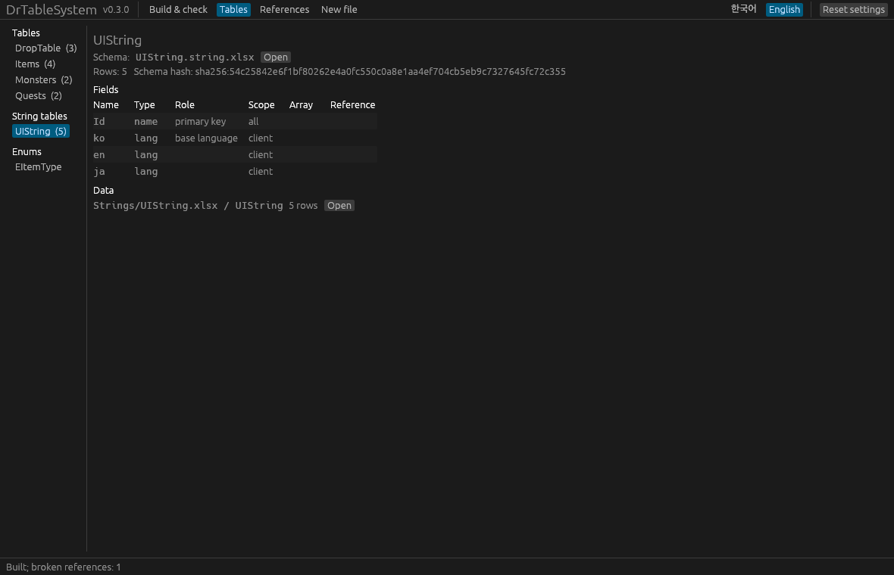

# DrTableSystem manual

DrTableSystem (DesignToRuntime Table System) carries the data designers write in spreadsheets all the way to the game runtime. It keeps a table's **structure (schema)** apart from its **data**, and produces:

- **Unreal C++**: `USTRUCT` row types, `UENUM` enums, one DataAsset class per table, and optionally typed lookup functions and a registration header. **Generated from the schemas only**, so data edits never change code.
- **Client JSON**: the rows a game client needs, plus prebuilt key indices, ready to be baked into DataAssets.
- **Server JSON**: the rows a server needs (server-only fields included, client-only fields excluded).
- **String tables**: text that differs per language, such as UI text and item names. Each language gets its own file and asset; the game loads only the current language and switches at runtime (section 8).

The **DrTableSystem Unreal plugin** bakes the client JSON into DataAssets, loads them at runtime without copying or building indices, and detects stale assets. String tables are baked per language; only the current language stays in memory, and `OnLanguageChanged` tells the UI when the language changes.

```
Schemas (Schema/*.schema.xlsx, *.string.xlsx, Enums/*.enum.xlsx) ─┐                 ┌─▶ C++ headers ─────────────▶ compile
                                                      ├▶ drtable build ─┼─▶ client JSON ─▶ DrTableBake ─▶ DA_*.uasset ─▶ runtime lookups
Data workbooks (*.xlsx, Strings/*.xlsx: field names in row 1) ──┘                 └─▶ server JSON ─▶ your server
                 drtable check  ◀─ client/server JSON  (reference integrity, CI)
                 drtable graph  ─▶ references.md       (Mermaid diagram)
```

| Who | Edits | Effect |
|---|---|---|
| Programmers | schemas (fields, types, scopes, enum values, string table languages) | code changes → reviewed |
| Designers | data workbooks (values, rows, splitting into files and sheets) | only JSON and assets change; code stays the same |
| Translators | string data in the `Strings/` folder | only per-language JSON and assets change; code stays the same |

Contents

1. [Installation](#1-installation)
2. [Schemas and data](#2-schemas-and-data)
3. [Types](#3-types)
4. [Keys and defaults](#4-keys-and-defaults)
5. [Arrays](#5-arrays)
6. [Enums](#6-enums)
7. [References between tables](#7-references-between-tables)
8. [String tables](#8-string-tables)
9. [Outputs](#9-outputs)
10. [Command line](#10-command-line)
11. [Unreal plugin](#11-unreal-plugin)
12. [Change detection: schema hash and content hash](#12-change-detection-schema-hash-and-content-hash)
13. [Lookup correctness rules](#13-lookup-correctness-rules)
14. [CI](#14-ci)
15. [Troubleshooting](#15-troubleshooting)

---

## 1. Installation

`drtable` is **a single executable with nothing to install**. Download the archive for your platform from GitHub Releases (Windows `x86_64-pc-windows-msvc`, macOS `aarch64-apple-darwin`, Linux `x86_64-unknown-linux-gnu`) and put `drtable` (command line) and `drtable-gui` (window, section 10) wherever you like (`.exe` on Windows). For a team, commit it to the project repository (for example `Tools/DrTable/drtable.exe`) so that syncing the repository is all anyone needs.

```sh
drtable --version
```

To build it yourself you need [Rust](https://rustup.rs/):

```sh
cd rust
cargo build --release                                  # rust/target/release/drtable
cargo build --release --features gui --bin drtable-gui  # rust/target/release/drtable-gui
```


For Unreal, copy `unreal/DrTableSystem` into your project's `Plugins/` folder ([section 11](#11-unreal-plugin)). The plugin is developed and tested with Unreal Engine 5.8.

Messages are in English by default. Pass `--lang ko` or set `DRTABLE_LANG=ko` for Korean. Generated files are always in English.

## 2. Schemas and data

### Folder layout

```
Design/Tables/                    ← --input (data)
  Items.xlsx
  Monsters.xlsx
  event/Summer.xlsx               ← subfolders are read too
  Schema/                         ← --schema (table schemas)
    Types.using.xlsx              ← type aliases (section 3)
    Items.schema.xlsx
    Monsters.schema.xlsx
  Enums/                          ← --enums (enum schemas, default: Enums next to the schema folder)
    ItemType.enum.xlsx
  Strings/                        ← --strings (string table data, default: Strings next to the schema folder, section 8)
    UIString.xlsx
```

- One schema file per table, and one file per enum in the enum folder. The file name must match the name it defines (`Items.schema.xlsx` ↔ table `Items`). String table schemas (`UIString.string.xlsx`) go in the schema folder too (section 8).
- The enum folder sits **next to** the table schema folder. Without `--enums`, `Enums` next to the schema folder is used (`Table/Schema` → `Table/Enums`).
- Without `--schema`, `*.schema.xlsx` and `*.string.xlsx` files are looked up anywhere under the input folder, and the enum and strings folders are `Enums` and `Strings` inside it. Schema files are skipped when reading data.
- Workbooks in the strings folder are read as string table data only (section 8).
- Excel lock files (`~$…`) and hidden folders (starting with `.`) are skipped.

### Schema files

`Items.schema.xlsx`: one sheet named after the table. Row 1 holds labels; from row 2, one field per row.

| | A Field | B Type | C Scope | D Comment |
|---|---|---|---|---|
| **1** | `Field` | `Type` | `Scope` | `Comment` |
| **2** | `Id` | `ID<int32>` | `all` | |
| **3** | `Name` | `SubKey<name>` | `all` | display name |
| **4** | `Element` | `SubKey<EElement>` | `all` | |
| **5** | `Damage` | `float=0` | `client` | damage per second |

- **Type** may carry a key role or a default: `int32`, `ID<int32>`, `SubKey<name>`, `float=1.0` (sections 3 and 4).
- **Scope**: `all` both, `client` client only, `server` server only, `#` comment (excluded everywhere). Case-insensitive.
- Field order is the member order of the C++ struct.

### Data workbooks

| Row | Content |
|---|---|
| 1 | Field names. The build finds the schema's fields by these names. |
| 2-3 | For reference (type and scope). **The build never reads them.** Usually formulas that show the schema (see reference headers below). |
| 4+ | Data |

- **The sheet name is the table name.** Sheets starting with `#` are notes, and text from a `#` inside a name is a comment (`Items#Weapons` is table `Items`).
- **Column order is free** and may differ from the schema.
- Columns whose row-1 name starts with `#` are notes. An empty name in row 1 ends the header; columns to its right are not read. Rows whose data cells are all empty are skipped.
- A name that is not in the schema, a missing field and a duplicate name are errors. **Fields are added in the schema.**
- A table that has a schema but no data sheet is generated with zero rows.

### Reference headers

Rows 2 and 3 of a data sheet hold formulas that look up each row-1 field name in the table's schema spreadsheet and show its type and scope, so schema changes show up when the workbook is opened. `drtable new --table Items --out Design/Tables/Items.xlsx --schema Design/Tables/Schema` creates a **new** data workbook with these formulas.

```
row 2: =IFERROR(INDEX('[1]Items'!$B:$B,MATCH(A$1,'[1]Items'!$A:$A,0)),"(not in schema)")
```

- When you add a column, drag the formulas from the next column. Unknown names show `(not in schema)`.
- The tool **never changes existing data workbooks** (designers may be editing them). To add the formulas to one, copy rows 2-3 from a workbook made by `drtable new`.
- If Excel warns about external links when opening, choose "Enable Content", or add the data folder to Excel's **Trusted Locations**.

**Link paths.** Excel keeps a link relative only when the schema file sits in the data workbook's **folder or below it**. Otherwise (for example data in `event/` and schemas in `Schema/` next to it) the link stores the absolute path of whoever saved the workbook, and someone who checked out the repository elsewhere keeps seeing the values from that save even after the schema changes. This never affects the build, and the build reports such workbooks (`the reference headers link to a path that does not exist here`). Fix the link in Excel (Data → Edit Links → Change Source) or paste rows 2-3 again from a workbook made by `drtable new`. Teams that check out to the same path never hit this.

### Split tables

A large table, or one several people maintain, can be split over several sheets and files. Every sheet whose **table name** (the sheet name without its `#` comment) is the same belongs to one table, and all of them follow the same schema.

```
Design/Tables/
  Items.xlsx           sheets Items#Weapons, Items#Armor
  event/Summer.xlsx    sheet  Items#Summer event
```

- Duplicate primary keys and name keys differing only by case are checked across all sheets, and the error names both places, for example `[event/Summer.xlsx]Items#Summer event!A5: duplicate primary key '3' (first at [Items.xlsx]Items#Weapons!A4)`.
- Rows are sorted by primary key, so the output is the same as for the unsplit table.
- The manifest records which files and sheets hold each table's data (`sources`, section 9).

### Locations

Every error message starts with a `[File]Sheet!Cell` location, e.g. `[Items.xlsx]Items!A7`, `[Items.schema.xlsx]Items!B4`.

File paths are relative to the input folder (data) or the schema folder.

## 3. Types

| Type | C++ | Client JSON | Server JSON |
|---|---|---|---|
| `int32`, `int64` | `int32`, `int64` | number | number |
| `float`, `double` | `float`, `double` | number | number |
| `fixed<N>`, `fixed64<N>` | `int32`, `int64` (in 1/N units) | integer | integer |
| `datetime`, `datetime<+09:00>` | `FDateTime` | integer milliseconds (UTC) | integer milliseconds (UTC) |
| `duration` | `FTimespan` | integer milliseconds | integer milliseconds |
| `bool` | `bool` | true/false | true/false |
| `name` | `FName` | string | string |
| `string` | `FString` | string | string |
| `text` | `FText` | string | string |
| `tag` | `FGameplayTag` | string | string |
| `path` | `FSoftObjectPath` | string | string |
| `E<Enum>` | `E<Prefix><Enum>` | enumerator name | enumerator name |
| `Ref<Table>` / `Ref<Table.SubKey>` | type of the target key | same as the target | same as the target |

- **Prefer `fixed<N>` for decimals (see Fixed point below).** `float` and `double` work, but Excel values become binary fractions with rounding errors (`0.1` → `0.100000001…`), and the last digits of results can differ between client, server and devices. Use `fixed<N>` for values that decide outcomes (chances, multipliers, damage factors) and keep `float` for presentation values that may differ slightly (effect timings, offsets).
- The server is not assumed to be Unreal: `name`, `string`, `text`, `tag` and `path` are plain strings in server JSON.
- `path` is always an untyped `FSoftObjectPath`. Convert with `TSoftObjectPtr<T>(Path)` at runtime when you need a typed pointer.
- `bool` accepts TRUE/FALSE, 1/0 and the strings `true`/`false`.
- Nested structs are not supported; use arrays (section 5) or references to other tables (section 7).

### Fixed point: `fixed<N>`

**`fixed<N>` is the recommended type for decimals in game data**, above all for values that must not drift, such as chances and multipliers. The value is stored as an integer count of 1/N. Clients and servers compute with the same integers, so their results match to the bit (`float` results can differ in the last digit between devices and compilers).

| Schema | Written in Excel | JSON and assets | C++ |
|---|---|---|---|
| `CritRate: fixed<10000>` (per ten thousand) | `0.1234` or `12.34%` | `1234` | `int32 CritRate = 1234;` |
| `Gold: fixed64<1000000>` | `12.345678` | `12345678` | `int64 Gold = 12345678;` |

- `N` is a power of ten such as 10, 100, 1000 (`fixed` up to 10⁹, `fixed64` up to 10¹⁸).
- Write decimals or percentages in Excel; percent-formatted cells (`12.34%`) work as they are. A value finer than the scale (`0.12345` with 10000) or out of range (`fixed<10000>` holds ±214748) is an error, so rounding never changes a value silently.
- The row struct gets a scale constant, `static constexpr int32 CritRateScale = 10000;`, and the property gets `meta = (DrFixedScale = "10000")`.
- Compute with integers, e.g. `Damage * CritRate / FGmItemsRow::CritRateScale` (use `int64` when the product can overflow). Convert only for display, e.g. `CritRate / 100.0f`.
- Defaults (`fixed<10000>=0.05` → 500) and arrays work; fixed-point fields cannot be keys.

### Time: `datetime`, `duration`

| Schema | Written in Excel | JSON | C++ |
|---|---|---|---|
| `Start: datetime<+09:00>` | a date-formatted cell, `2026-10-01 10:00`, `2026-10-01` | `1790816400000` (Unix time in milliseconds, UTC) | `FDateTime` |
| `Cooldown: duration` | a time-formatted cell (`1:30:00`), `90s`, `1h30m`, `2d`, `500ms`, `1:30` | `5400000` (milliseconds) | `FTimespan` |

- **The time zone is part of the schema type**: `datetime<+09:00>` reads Excel values as Korea time and stores UTC; plain `datetime` is UTC. A cell that writes `Z` or `+09:00` itself wins. When many tables share it, use an alias (`KstTime | datetime<+09:00>`).
- A plain number in a `datetime` cell is an error (it could be an Excel serial date); use a date-formatted cell or date text.
- A plain number in a `duration` cell is seconds (`30` → 30 s, `1.5` → 1.5 s). Negative durations are errors.
- Empty cells are 0 (for `datetime`, 1970-01-01 00:00 UTC). Defaults work (`duration=30s`, `datetime<+09:00>=2026-01-01`). Time fields cannot be keys.
- The server JSON carries the same millisecond integers, ready to compute in any language. The bake writes FDateTime / FTimespan into Unreal assets (1 ms = 10,000 ticks). Fields with a time zone get `meta = (DrTimeZone = "+09:00")`.

### Type aliases: `*.using.xlsx`

When the same kind of value appears in many tables, **name its type once** and use the name. Changing the alias changes every field that uses it (for example item keys from `int32` to `int64`).

`Schema/Types.using.xlsx` (any sheet name):

| | A Name | B Type | C Comment |
|---|---|---|---|
| **1** | `Name` | `Type` | `Comment` |
| **2** | `ItemID` | `int32` | item key |
| **3** | `ItemRef` | `Ref<Items>` | item reference |
| **4** | `Rate` | `fixed<10000>` | per ten thousand |
| **5** | `Level` | `int32=1` | default 1 |

```
Items:   Id: ID<ItemID>     DropRate: Rate
Quests:  Id: ID<int32>      Reward: ItemRef      MinLevel: Level=5
```

- An alias can stand for **any type**: primitives, `fixed<N>`, enums, `Ref<…>`, other aliases, and defaults.
- Use it as a field type (`Rate`), as a key (`ID<ItemID>`, `SubKey<ItemRef>`) or with a default (`Level=5`). A field's default wins over the alias default. Key rules (which types can be keys, no defaults on keys) apply to the expanded type.
- Any number of `*.using.xlsx` files can sit in the schema folder (e.g. `Items.using.xlsx`, `Combat.using.xlsx`); a name defined twice is an error. An alias carries no key role (`ID<…>`).
- A name that is a type name (`int32` …), a table name or an enum type (`E…`), and aliases that loop, are errors.
- The schema hash uses the expanded types: renaming an alias keeps it, changing the type an alias stands for changes it.
- C++: Unreal reflection cannot read typedefs, so struct fields use the underlying types. Their properties get `meta = (DrType = "ItemID")`, and an alias header `<Prefix>Types.h` is written for game code (`using GmItemID = int32;`, plus `GmRateScale` for fixed point).

## 4. Keys and defaults

- **Primary key** `ID<type>`: exactly one per table, scope must be `all`, values must be unique and non-empty.
- **Sub keys** `SubKey<type>`: any number. Each gets a prebuilt index, so "all rows whose `Element` is `Fire`" is a binary search instead of a scan. Values may repeat.
- Key types are limited to `int32`, `int64`, `name` and enums. Floating point comparisons are unstable, `bool` is meaningless as a key, and `string`/`text`/`tag`/`path` have no comparison that matches the generator's ordering.
- **Defaults**: `float=1.0`, `bool=true`, `string=none`. Empty cells take the declared default, otherwise the type default (0, false, empty, first enumerator). Keys cannot have defaults.

## 5. Arrays

In a schema, fields numbered `Field[0]`, `Field[1]`, … form one fixed-size array field. Data workbooks use the same names (`Reward[0]`, …) in row 1.

| Field | Type | Scope |
|---|---|---|
| `Id` | `ID<int32>` | `all` |
| `Reward[0]` | `int32` | `all` |
| `Reward[1]` | `int32` | `all` |
| `Reward[2]` | `int32` | `all` |

- C++: a C-style array, `int32 Reward[3] = {};`, stored inline in the row with no heap allocation.
- JSON: a real array, `"Reward": [10, 20, 30]`.
- Indices must start at 0 without gaps, and all elements must share type and scope. Arrays cannot be keys.
- Unreal cannot expose C-style arrays to Blueprint, so array properties are `EditAnywhere` only.
- Each element may declare its own default (`int32=10`, `int32=20`).

## 6. Enums

An enum's values become a C++ `UENUM`, so they **belong to the schema**. Each enum is one file in the enum folder (default: `Enums` next to the schema folder).

`Enums/ItemType.enum.xlsx`, sheet `ItemType`:

| | A Name | B Value | C Comment |
|---|---|---|---|
| **1** | `Name` | `Value` | `Comment` |
| **2** | `Weapon` | `0` | swords, bows |
| **3** | `Armor` | | helmets, armor |

- Values are optional (the first is 0, then previous + 1). They must fit in uint8 and be unique.
- Comments become comments in the generated code.
- Tables use the enum as `E<Name>` (`EItemType`).
- Enums cannot be split; defining the same name twice is an error.
- **Per-enumerator data** (display names, icons, …) is an ordinary table keyed by the enum, for example `ItemTypeInfo.schema.xlsx` with `Id: ID<EItemType>`, `DisplayName: text`, … and an `ItemTypeInfo` data sheet.

## 7. References between tables

A `Ref<Items>` field holds a primary key value of table `Items`. Its actual type is the type of the target key, so changing that key type changes the reference field too.

```
Quests:   Id: ID<int32>   RewardItem: Ref<Items>   Next[0]: Ref<Quests>   Next[1]: Ref<Quests>
```

- **An empty cell means "no reference"**: `0` for numeric keys, an empty name for `name` keys. References to an enum-keyed table cannot be empty (an enum has no "none" value).
- Self references and cycles between tables are allowed. Arrays and `SubKey<Ref<...>>` work. `ID<Ref<...>>` and defaults on references do not.

**Sub key references.** `Ref<DropTable.GroupId>` points at every row whose sub key `GroupId` has that value: one value, many rows (1:N).

```
Monsters:   Id: ID<name>        DropGroup: Ref<DropTable.GroupId>
DropTable:  Id: ID<int32>       GroupId: SubKey<int32>      Item: Ref<Items>
```

- The field after the dot must be declared `SubKey<>` (it needs an index). Use `Ref<Table>` for the primary key.
- A reference field cannot have a wider scope than the sub key it targets; an `all` field pointing at a `client`-only sub key could not be checked in the server output.
- When the target sub key is itself a reference, types are resolved along the chain. Cycles that can never resolve are reported with the full path.

**Validation.** `build` checks the schema only (the target exists, types resolve). Whether each value exists is checked on the generated JSON by `drtable check` (section 10). Generated C++ carries `meta = (TableRef = "Items")` (plus `TableRefKey = "GroupId"` for sub key references) so editor tools can follow references.

## 8. String tables

Text that differs per language, such as UI text and item names, lives in string tables. The game keeps **only the current language** in memory. Switching languages loads the new one, swaps it in at once, and then fires a delegate so the UI can redraw.

### Schema: `<Name>String.string.xlsx`

A string table schema is just a **list of languages**, with no types. It goes in the schema folder named **after the table** (`<Name>.string.xlsx`, with a sheet of the same name). A string table name **must end with `String`** (`UIString.string.xlsx`, sheet `UIString`), so it never clashes with a regular table `UI`.

`Schema/UIString.string.xlsx`, sheet `UIString`:

| | A Language | B Base | C Scope | D Comment |
|---|---|---|---|---|
| **1** | `Language` | `Base` | `Scope` | `Comment` |
| **2** | `ko` | `✓` | | |
| **3** | `en` | | | |
| **4** | `zh-Hans` | | | Simplified |

- **The language code is the column name in the data** (`ko`, `en`, `zh-Hans`, `pt-BR` …). `zh_Hans` with `_` means the same.
- **Base**: mark one language with any value in column B (✓, O, TRUE …). Exactly one is required, and it may differ between tables (for example `en` for system messages). An empty cell, FALSE or 0 is not a mark.
- **Scope**: empty means `client`. Text the server also needs (mail titles, say) can be `all` so that it reaches the server JSON.
- The key is always `Id` (a name), so it is not listed.
- Regular schemas (`.schema.xlsx`) cannot have language columns.

### Data: the strings folder

String table data workbooks go in the **strings folder**. Translators can work on that folder alone, and their files never overlap with game data edits.

```
Design/Tables/          data
Design/Tables/Schema/   schemas (string table schemas too)
Design/Tables/Enums/    enums
Design/Tables/Strings/  string table data (--strings, default: Strings next to the schema folder)
  UIString.xlsx         sheet UIString: row 1 Id ko en zh-Hans, data from row 4
```

- As for other tables, **the sheet is named after the table** (`UIString`). Schema, data and code all use the same name.
- Without `--schema`, the strings folder is `Strings` inside the input folder. Splitting sheets and files (`UIString#Menu`) works as for other tables.
- These are errors:
  - a string table sheet outside the strings folder
  - another table's sheet inside the strings folder
  - an empty base language cell
- **An empty cell in another language takes the base language text at build time**, with one warning line per language. That way the game never shows a gap while only the current language is loaded.
- A translation whose format arguments (`{0}`, `{Name}`) differ from the base text is warned per cell.
- A cell that holds only a number (`100`) is read as text.
- Row 1 must have **every language column** of the schema (keep the column even before it is translated). Column order is free, and `#` note columns may be added.
- Create a new data workbook with `drtable new --table UIString --out Design/Tables/Strings/UIString.xlsx --schema Design/Tables/Schema`.

### Outputs

```
client/Strings/ko/UIString.json    {"table", "language", "base_language", "schema_hash", "content_hash", "keys", "values"}
client/Strings/en/UIString.json
client/manifest.json               "string_tables": base language, languages, content hash per language, data sources
```

- Keys are sorted like primary keys; `values` holds the text in the same order.
- String tables get no row struct or asset class. **Editing text or adding keys never changes C++ code.**
- `--string-keys` also writes key constants (`<Prefix><Table>Keys.h`, e.g. `DrUIStringKeys::Btn_OK`). The keys come from the data, so this header changes whenever a key is added. It is off by default.

### Pointing at strings from other tables

When a regular table points at a string table key, as in `Name: Ref<ItemString>` (schema `ItemString.string.xlsx`), the generated accessor returns **the text in the current language**:

```cpp
const FGmItemsRow* Sword = FGmItemsRow::Find(1001);
FText Name = Sword->GetName();   // ItemString text in the current language
```

`drtable check` checks string table keys too. The GUI lists string tables separately in the Tables tab (language columns and the base language), and the strings folder is set in the Build & check tab.



### In Unreal

`DrTableBake` writes one asset per language (`<AssetRoot>/Strings/<language>/DA_<Table>`, e.g. `/Game/Data/Strings/en/DA_UIString`; names follow `--asset-name`). It also writes the language list asset `<AssetRoot>/Strings/DA_DrStrings`. A table without a language uses its base language asset for it.

`UDrStringSubsystem` (a GameInstance subsystem) picks the starting language and loads it **synchronously**, so the first frame already has text. The starting language is chosen in this order:
1. the language chosen last time (`GameUserSettings.ini`)
2. the engine culture (`ko-KR` also matches `ko`)
3. the default language of the list (the base language most tables use)

```cpp
UDrStringSubsystem* Strings = GetGameInstance()->GetSubsystem<UDrStringSubsystem>();
Strings->OnLanguageChanged.AddDynamic(this, &UMyWidget::HandleLanguageChanged);   // also bindable in Blueprint
Strings->SetLanguage(TEXT("en"));                                                  // asynchronous
FText Title = Strings->GetText(TEXT("UIString"), TEXT("Title_Main"));
```

- `SetLanguage` loads the new language's assets **asynchronously**. The previous language stays on screen until they have loaded.
- When everything has loaded, the languages are swapped at once. The previous language's assets are released and the garbage collector unloads them. Then `OnLanguageChanged` fires (Blueprint). C++ can also use `Strings->GetTables()->OnLanguageChanged` (a native delegate).
- If another language is requested while one is loading, only the last request takes effect. An unknown language logs a warning and keeps the current one.
- A missing key shows `<Table.Key>` and warns once in development builds. Shipping builds return empty text.
- Text is returned as `FText::AsCultureInvariant`. It does not mix with engine localization (.locres) and works with `FText::Format`.
- **`UDrLocalizedTextBlock`**: a TextBlock with `Table` and `Key` that redraws itself when the language changes. Most UI needs nothing else.
- Project Settings → Plugins → DrTable → Strings:
  - `bRememberStringLanguage` (on): saves the chosen language for the next run.
  - `bStringsFollowCulture` (off): switches when the engine culture changes.
- Console commands: `DrStrings.Status`, `DrStrings.Language en`.

## 9. Outputs

### C++

```
<out-cpp>/EDrElement.h          one per enum
<out-cpp>/DrEffectsRow.h        row struct per table
<out-cpp>/DrEffectsTable.h      DataAsset class per table
<out-cpp>/DrGeneratedTables.h   name, key and schema hash constants
<out-cpp>/DrUIStringKeys.h      string table key constants (only with --string-keys)
<out-cpp>/DrTypes.h             type aliases (only when *.using.xlsx exist)
```

With `--runtime-header` (or `--ue-plugin`) also:

```
<out-cpp>/DtEffectsRow.cpp        lookup and reference function definitions
<out-cpp>/DtTableRegistration.h   DtGeneratedTables::RegisterAll(Registry)
```

- Row struct `F<Prefix><Table>Row`, asset class `U<Prefix><Table>Table`, enum `E<Prefix><Enum>`. The default `--prefix` is `Dr`; set your project's prefix.
- Only client fields (`all`, `client`) are generated.
- **Generated code depends on the schemas only.** Data values, data file names and row counts never reach the code, so editing data or splitting it into files and sheets leaves the code byte-for-byte the same. The first comment line names the schema file (`// … Source: Items.schema.xlsx`).
- The asset class holds `Rows` (sorted by primary key), `PrimaryKeys` (same order) and, per sub key, `<Name>_Keys`, `<Name>_Offsets`, `<Name>_Indices` (a CSR index computed by the generator).

**Row functions** (with `--runtime-header`). Plain C++ members, not exposed to Blueprint.

| Function | Generated for | Returns |
|---|---|---|
| `static const FRow* Find(Key)` | every table | the row or nullptr |
| `static TArray<const FRow*> FindBy<SubKey>(Key)` | every sub key | matching rows |
| `static TConstArrayView<FRow> GetAll()` | every table | all rows |
| `const FTargetRow* Get<Field>() const` | `Ref<Target>` fields | the referenced row or nullptr |
| `TArray<const FTargetRow*> Get<Field>() const` | `Ref<Target.SubKey>` fields | the referenced rows |
| `FText Get<Field>() const` | `Ref<StringTable>` fields | the text in the current language (empty when the reference is empty) |
| `Get<Field>(int32 Index) const` | reference arrays | as above, for one element |

Empty references return nullptr or an empty array without a lookup. A generated name that clashes with a field (e.g. a field named `Find`) is a generation error.

Generated functions call only four functions provided by the runtime header (`GetText` only when there are string table references). The Unreal plugin's `DrTableRuntime.h` implements them; other environments can implement them too.

```cpp
namespace DrTableRuntime {
  template <typename TRow, typename TKey> const TRow* FindByKey(const TKey& Key);
  template <typename TRow, typename TKey> TArray<const TRow*> FindAllBySubKey(FName SubKeyName, const TKey& Key);
  template <typename TRow> TConstArrayView<TRow> GetAll();
  FText GetText(FName Table, FName Key);
}
```

The registry passed to `RegisterAll(Registry)` needs `Register<Row, Asset>(FName Name, TArray<Row> Asset::*Rows, TArray<Key> Asset::*Keys)`, whose result must accept chained `WithSchemaHash(const TCHAR*)` and `WithSubKey(FName, Keys, Offsets, Indices)` calls.

### JSON

Client `Effects.json`:

```json
{
  "table": "Effects",
  "schema_hash": "sha256:…",
  "content_hash": "sha256:…",
  "primary_key": "Id",
  "primary_keys": [1001, 1002],
  "sub_keys": [{"name": "Element", "field": "Element",
                "keys": ["Fire", "Water"], "offsets": [0, 1, 2], "indices": [0, 1]}],
  "rows": [{"Id": 1001, "Name": "Burn", "Element": "Fire"}, …]
}
```

Server JSON has no indices and includes server fields. Each folder's `manifest.json` lists:

- the tables: row count, schema and content hashes, schema file (`schema`) and where the data comes from (`sources`: file, sheet, rows)
- the enums and the references
- the string tables (`string_tables`): base language, languages, content hash per language, schema file and data sources (section 8)
- the naming rules the bake tool uses (`cpp_prefix`, `asset_name`)

Outputs are **deterministic**: the same input gives the same bytes (LF line endings, fixed key order, no timestamps unless `--stamp` is given). Output folders are cleared before writing, so removed tables leave no files behind.

## 10. Command line

```sh
drtable build --input <xlsx|folder> --out-cpp <dir> --out-client <dir> --out-server <dir>
               [--schema <folder>] [--enums <folder>] [--strings <folder>] [--string-keys]
               [--prefix Dr] [--ue-plugin] [--asset-base <Class> --asset-base-header <Header.h>]
               [--runtime-header <Header.h>] [--asset-name DA_{table}] [--stamp <ISO8601>]
drtable graph --input <xlsx|folder> --out references.md [--schema …] [--enums …] [--strings …]
drtable check --client <client JSON folder> [--server <server JSON folder>]
drtable check --input <xlsx|folder> [--schema …] [--enums …] [--strings …]   # validate only, write nothing
drtable new --table <Table> --out <new xlsx> --schema <folder> [--enums …]  # new data workbook with reference formulas
drtable [--lang en|ko] …
```

| Option | Meaning |
|---|---|
| `--schema` | Table schema folder. Default: the input folder. |
| `--enums` | Enum schema folder. Default: `Enums` next to the schema folder (`Enums` inside the input folder without `--schema`). |
| `--strings` | String table data folder. Default: `Strings` next to the schema folder (`Strings` inside the input folder without `--schema`). |
| `--string-keys` | Also write string table key constant headers (they change when keys change, section 8). |
| `--prefix` | C++ type prefix (`Dr` → `FDrEffectsRow`, default `Dr`). |
| `--ue-plugin` | Settings for the DrTableSystem plugin: asset base `UDrTableAssetBase`, runtime header `DrTableRuntime.h`. Recommended with the plugin. |
| `--asset-base`, `--asset-base-header` | Base class of the asset classes and the header declaring it. Changing the base without its header is an error, since the code would not compile. |
| `--runtime-header` | Generates row functions, `.cpp` files and the registration header. |
| `--asset-name` | Asset name pattern for registration and baking. Must contain `{table}`. |
| `--stamp` | Adds `generated_at` to the manifest (for CI traceability; deliberately breaks byte-identical output). |

- `graph` writes a Mermaid `flowchart` that GitHub renders directly: one node per table (with its key type), one edge per reference, labelled with the field name, `[N]` for arrays, `(SubKey)` when the referencing field is a sub key and `→ Key 1:N` for sub key references.
- `check --client/--server` reads only the generated JSON, so it runs in CI. It lists every broken reference (e.g. `Quests.Next[2002](0) = 9999 → not in Quests`), skips empty references, and warns when a target table has a key equal to the "no reference" value (0 or an empty name).
- Warnings (`warning: …`) go to standard error and do not change the exit code.

Exit codes: `build`, `graph`, `check --input` and `new` return 0 on success, 1 on validation errors, 2 on usage errors. `check --client` returns 0 when clean, 1 on broken references, 2 on input errors.

### GUI (`drtable-gui`)

`drtable-gui` offers the same features in a window. It is a single executable with nothing to install, and it restores its settings (folders, prefix, language) on the next start; **Reset settings** (top right) returns to the defaults.

| Tab | What it does |
|---|---|
| Build & check | Pick the folders, then check or build. A build also checks the references in its output. Errors and warnings are listed with their `[File]Sheet!Cell` location; double-click one to open its workbook in Excel. |
| Tables | Tables, string tables and enums with their fields (type, key, scope, array, reference), schema file, and the files and sheets holding their data with row counts. |
| References | The reference graph. Drag nodes to move them; broken references are red; double-click a node to open its table. |
| New file | Creates a new data workbook with the reference formulas (`drtable new`). Existing data workbooks are never changed. |


A shortcut can open a project directly:

```sh
drtable-gui --input Design/Tables --schema Design/Tables/Schema --out-cpp Source/MyGame/TableData/Generated \
  --out-client Intermediate/DrTable/client --out-server Build/ServerData --prefix Gm --lang en --check
```

`--check` or `--build` runs as soon as the window opens, and `--tab tables|graph|files` picks the first tab. Hangul is drawn with a system font (Malgun Gothic on Windows, Apple SD Gothic Neo on macOS, Noto CJK or Nanum Gothic on Linux).

## 11. Unreal plugin

`unreal/DrTableSystem` has two modules:

- **DrTableRuntime**: `UDrTableAssetBase`, `TDrTableRowTable`, `UDrTableRegistry` (owned by the engine subsystem `UDrTableSubsystem`), `UDrTableSettings`, the `DrTableRuntime` lookup contract, `DRTABLE_AUTO_REGISTER`, and string tables (`UDrStringSubsystem`, `UDrStringTables`, `UDrLocalizedTextBlock`, section 8).
- **DrTableEditor**: the `DrTableBake` commandlet and the plugin's automation tests (`DrTable.*`).

### Setup

1. Copy `unreal/DrTableSystem` to `<Project>/Plugins/DrTableSystem` and enable it (`"Plugins": [{"Name": "DrTableSystem", "Enabled": true}]`).
2. Add `"DrTableRuntime"` to your game module's `PublicDependencyModuleNames`.
3. Generate into the module's source folder:
   ```sh
   drtable build --input Design/Tables --schema Design/Tables/Schema --prefix Gm --ue-plugin \
     --out-cpp Source/MyGame/TableData/Generated \
     --out-client Intermediate/DrTable/client --out-server Build/ServerData
   drtable check --client Intermediate/DrTable/client --server Build/ServerData
   ```
4. Register the generated tables once, in any `.cpp` of that module:
   ```cpp
   #include "DrTableRegistry.h"
   #include "TableData/Generated/GmTableRegistration.h"

   DRTABLE_AUTO_REGISTER(GmGeneratedTables::RegisterAll<UDrTableRegistry>);
   ```
5. Build the editor, then bake:
   ```sh
   UnrealEditor-Cmd MyGame.uproject -run=DrTableBake -Input=Intermediate/DrTable/client -Out=/Game/Data
   ```
6. Use the rows:
   ```cpp
   if (const FGmItemsRow* Sword = FGmItemsRow::Find(1001))
   {
       const FGmQuestsRow* Quest = Sword->GetQuest();          // Ref<Quests>
   }
   for (const FGmItemsRow* Weapon : FGmItemsRow::FindByKind(EGmItemType::Weapon)) { … }
   ```

When designers changed only data, rerun `drtable build` (step 3) and the bake (step 5). The code does not change, so nothing needs compiling.

String tables (section 8) need no registration. The same bake writes the per-language assets and the language list, and `UDrStringSubsystem` loads them when the game starts.

### Loading

On first lookup the registry loads every registered table from `<AssetRoot>/<AssetName>.<AssetName>`. `AssetRoot` is set in Project Settings → Plugins → DrTable (default `/Game/Data`). `ExtraAssets` adds assets or overrides the path of a table with the same asset name. With `bLoadOnFirstUse` off, call `UDrTableRegistry::Get()->LoadAllTables()` yourself.

Rows are read straight from the assets: no copies, no runtime index building. **Pointers and views returned by lookups stay valid only until the tables are reloaded** (`DrTable.Reload`, or re-baking in the editor). Do not keep them across a reload; look up again.

Console commands: `DrTable.Status` (tables and loaded row counts), `DrTable.Reload`.

### Baking

```
-run=DrTableBake -Input=<client JSON folder> [-Out=/Game/Data] [-Force] [-Verify]
```

- Class and asset names follow the manifest's rules, so they always match the generated code.
- Only tables whose asset is missing or whose hashes differ are saved. Saving the same data again still changes the package binary (GUIDs), so unchanged tables are skipped. `-Force` saves every table.
- `-Verify` saves nothing and fails when an asset is missing or stale.
- A table whose generated class is not compiled into the editor is an error: generate → build → bake, in that order.

### Using your own runtime

The generator does not depend on the plugin. Without `--ue-plugin` you get plain `UPrimaryDataAsset` classes and no lookup functions. With `--runtime-header MyRuntime.h` and `--asset-base`, your own system can drive the tables as long as it implements the contract in section 9.

## 12. Change detection: schema hash and content hash

Every table has two hashes.

| Hash | Covers | Recorded in | On mismatch |
|---|---|---|---|
| `schema_hash` | fields, types, key roles, scopes, declared defaults, enums the table uses | JSON, manifest, generated C++, assets | **error** at load, the table is not loaded |
| `content_hash` | the rows and indices of that output | JSON, manifest, assets | `DrTableBake -Verify` **fails** |

- If the schema changed but nobody regenerated, rebuilt and re-baked, the runtime rejects the old assets.
- Values that changed without a bake are caught by the bake check (`-Verify`). The content hash is kept out of generated code, since otherwise data edits would change the code. Run `-Verify` before shipping and in CI.
- String tables have a content hash per language, so editing one language re-bakes only that language's asset. `-Verify` also checks the per-language assets and the language list (`DA_DrStrings`).

## 13. Lookup correctness rules

Lookups binary-search arrays sorted by the generator, so the generator's ordering and the runtime comparison must agree exactly:

- numbers: numeric order
- **enums: by value, not by name**
- **names: Unicode code point order, case-sensitive** (`FName::LexicalLess` ignores case and compares numeric suffixes numerically, so it is not used)

What the tool enforces as a result:

- `name` key or sub key values **differing only by case** (`Sword` and `sword`) are errors: Unreal `FName` treats them as the same name.
- Changing enum values changes the schema hash of every table using that enum, so stale indices are rejected.
- Runtime key types must match exactly: an `int32`-keyed table is not found with an `int64` key.

## 14. CI

A typical pipeline:

```sh
drtable build … --ue-plugin
drtable check --client … --server …                     # fails on broken references
UnrealEditor-Cmd … -run=DrTableBake -Input=… -Verify    # fails on missing or stale assets
```

On every push, `.github/workflows/ci.yml` runs on Windows, macOS and Linux:

- the build of the executable and the GUI, and the unit tests
- the test suite against the executable (`rust/tests/`; the tests create their input workbooks)

A `v*` tag builds the executables for each platform and attaches them to a Release.

## 15. Troubleshooting

| Message | Cause and fix |
|---|---|
| `no schema or data workbook found` | The `--input` folder is empty. Check the path (building an empty folder would delete all generated code, so it stops with an error). |
| `no schema. Define the fields in 'X.schema.xlsx'` | No schema matches the data sheet's name. Create one, or check the `--schema` path. |
| `field 'X' is not in the schema …` | Row 1 has a name the schema does not define. Fix the typo or add the field to the schema (programmers). For a note column, start the name with `#`. |
| `no column for field 'X'` | A schema field has no column in the data sheet. Add the column. |
| `the reference headers link to a path that does not exist here` (warning) | The link was saved on another path. Fix it with Edit Links in Excel or paste rows 2-3 again (see Link paths in section 2). |
| `enum schemas belong in the enum folder (…)` | Move the `*.enum.xlsx` file into the enum folder. |
| `Schema mismatch, re-bake required` | The asset was baked with an older structure. Generate → build → bake. |
| `Class U…Table is not compiled into the editor` | Build the editor after `drtable build`, then bake. |
| `Table asset not found` | Registered but never baked, or `AssetRoot`/`--asset-name` differ between bake and load. |
| `Row type is registered for more than one table` | The same row struct was registered twice. Look it up by table id (`FindRowByKey<TRow>(TableId, Key)`). |
| `string table 'X' data belongs in the strings folder (…)` | Move the string table workbook into the strings folder (and other tables' workbooks out of it). |
| `mark one base language` | In `<Name>String.string.xlsx`, put a mark (✓) in column B (Base) of one language. |
| `no string table schema` | No `<Name>String.string.xlsx` matches the sheet name in the strings folder. |
| `name the sheet after the table: 'XString'` | Rename the sheet in the strings folder to the full table name (with `String`). |
| `a string table name must end with String` | Rename the schema file and sheet to `<Name>String`. |
| `… empty … translation(s) filled from the base language` (warning) | Cells not translated yet; the game shows the base language text. |
| `No text for Table.Key` (Unreal warning) | The key is not in the string table, or it was not baked. Generate → bake. |
| `--asset-base requires --asset-base-header` | Pass the header that declares the base class, or use `--ue-plugin`. |
| `generated function 'Find' clashes with a field of the same name` | Rename the field. `Find`, `GetAll`, `FindBy<SubKey>` and `Get<Field>` are generated names. |
| `name key 'x' differs from 'X' at … only by case` | Use identical spelling, or different names. |
