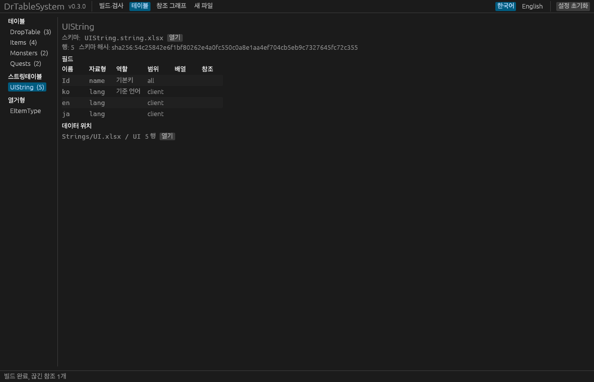
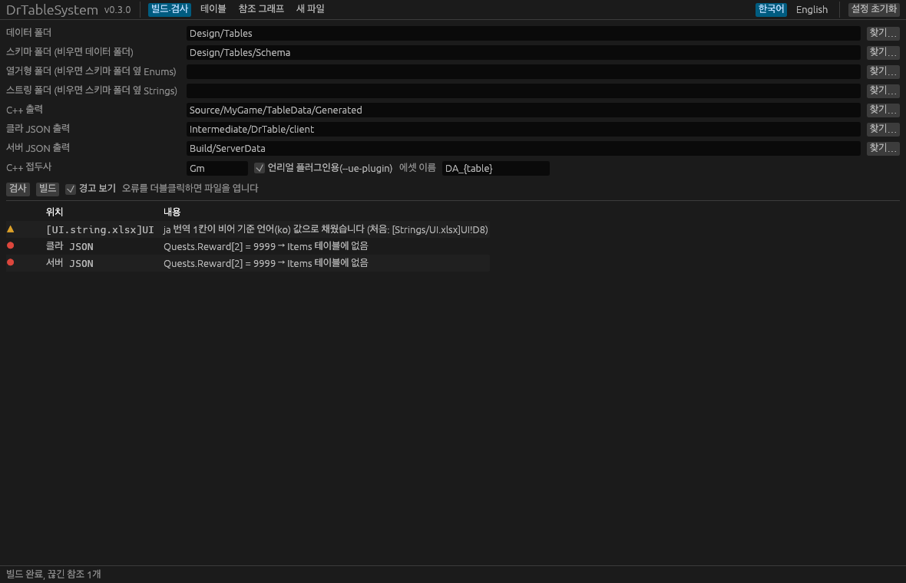
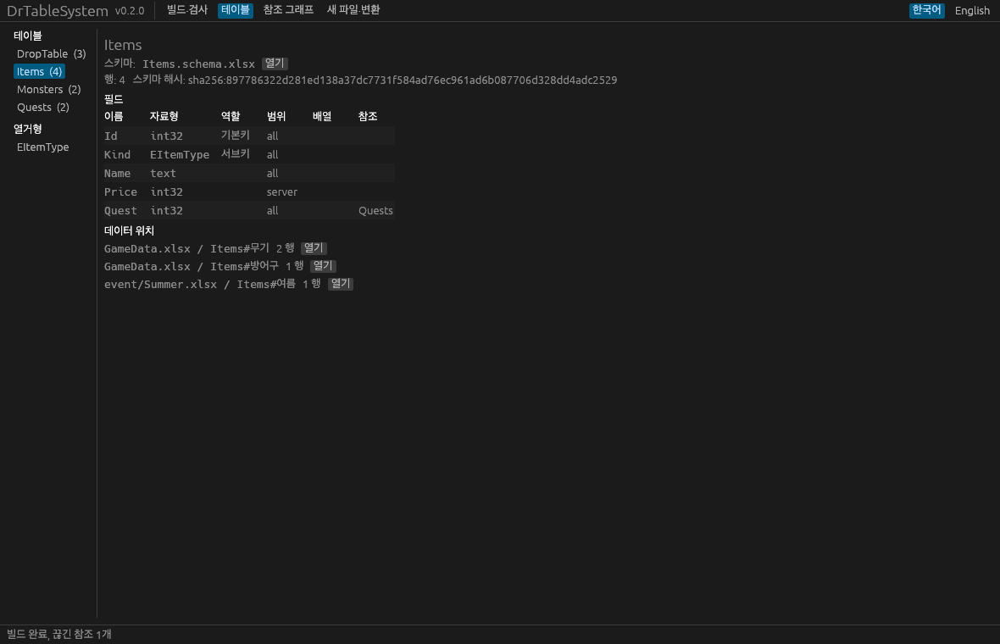
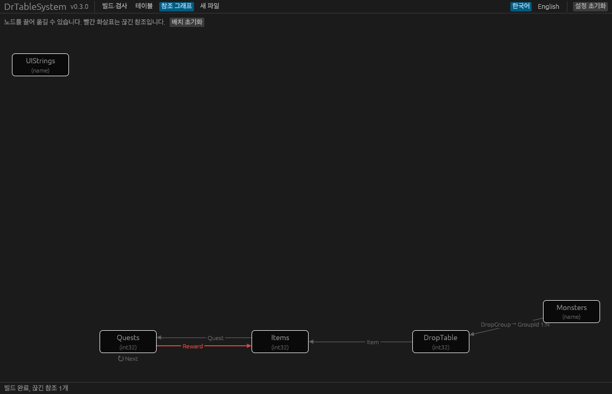

# DrTableSystem 매뉴얼

DrTableSystem(DesignToRuntime Table System)은 기획자가 엑셀에 적은 데이터를 게임 런타임까지 그대로 옮기는 테이블 시스템입니다. 테이블 **구조(스키마)**와 **데이터**를 나눠 관리하고, 다음을 만듭니다.

- **언리얼 C++**: `USTRUCT` 행 구조체, `UENUM` 열거형, 테이블마다 DataAsset 클래스 하나. 원하면 타입 안전 조회 함수와 등록 헤더까지. **스키마에서만 생성**하므로 기획이 데이터를 고쳐도 코드는 바뀌지 않습니다.
- **클라이언트 JSON**: 게임 클라이언트가 쓸 행과, 미리 계산한 키 인덱스. DataAsset으로 굽기 위한 입력입니다.
- **서버 JSON**: 서버가 쓸 행(서버 전용 필드 포함, 클라 전용 필드 제외).
- **스트링테이블**: UI 문구·아이템 이름처럼 언어마다 다른 글. 언어마다 파일·에셋을 따로 만들고, 게임은 설정 언어 하나만 불러와 런타임에 교체합니다(8절).

**DrTableSystem 언리얼 플러그인**은 클라 JSON을 DataAsset으로 굽고, 런타임에 복사나 인덱스 구축 없이 그대로 읽으며, 오래된 에셋을 잡아냅니다. 스트링테이블은 언어별 에셋으로 구워 현재 언어만 메모리에 두고, 언어를 바꾸면 `OnLanguageChanged`로 UI에 알립니다.

```
스키마(Schema/*.schema.xlsx, *.string.xlsx, Enums/*.enum.xlsx) ─┐        ┌─▶ C++ 헤더 ─────────────▶ 컴파일
                                                    ├▶ drtable build ─┼─▶ 클라 JSON ─▶ DrTableBake ─▶ DA_*.uasset ─▶ 런타임 조회
데이터 엑셀(*.xlsx, Strings/*.xlsx: 1행 필드명 + 4행부터) ─┘        └─▶ 서버 JSON ─▶ 서버
                 drtable check  ◀─ 클라·서버 JSON   (참조 무결성 검사, CI)
                 drtable graph  ─▶ references.md   (Mermaid 다이어그램)
```

| 누가 | 무엇을 | 결과 |
|---|---|---|
| 프로그래머 | 스키마(필드·자료형·범위, 열거형 값, 스트링테이블 언어 목록) | 코드가 바뀜 → 리뷰 대상 |
| 기획자 | 데이터 엑셀(값, 행, 파일·시트 나누기) | JSON·에셋만 바뀜, 코드는 그대로 |
| 번역 담당 | `Strings/` 폴더의 스트링 데이터 | 언어별 JSON·에셋만 바뀜, 코드는 그대로 |

목차

1. [설치](#1-설치)
2. [스키마와 데이터](#2-스키마와-데이터)
3. [자료형](#3-자료형)
4. [기본키·서브키·기본값](#4-기본키서브키기본값)
5. [배열](#5-배열)
6. [열거형](#6-열거형)
7. [테이블 간 참조](#7-테이블-간-참조)
8. [스트링테이블](#8-스트링테이블)
9. [산출물](#9-산출물)
10. [명령줄](#10-명령줄)
11. [언리얼 플러그인](#11-언리얼-플러그인)
12. [변경 감지: 스키마 해시와 내용 해시](#12-변경-감지-스키마-해시와-내용-해시)
13. [조회가 틀리지 않게 지키는 규칙](#13-조회가-틀리지-않게-지키는-규칙)
14. [CI](#14-ci)
15. [문제 해결](#15-문제-해결)

---

## 1. 설치

`drtable`은 **설치가 필요 없는 실행 파일 하나**입니다. GitHub Releases에서 운영체제에 맞는 압축 파일(윈도우 `x86_64-pc-windows-msvc`, 맥 `aarch64-apple-darwin`, 리눅스 `x86_64-unknown-linux-gnu`)을 받아 `drtable`(명령줄)과 `drtable-gui`(창, 10절)를 원하는 곳에 둡니다(윈도우는 `.exe`). 팀에서 쓸 때는 프로젝트 저장소(예: `Tools/DrTable/drtable.exe`)에 함께 넣으면 저장소만 받아도 바로 쓸 수 있습니다.

```sh
drtable --version
```

직접 빌드하려면 [Rust](https://rustup.rs/)가 필요합니다.

```sh
cd rust
cargo build --release                                  # rust/target/release/drtable
cargo build --release --features gui --bin drtable-gui  # rust/target/release/drtable-gui
```


언리얼 쪽은 `unreal/DrTableSystem`을 프로젝트의 `Plugins/` 폴더에 복사합니다([11절](#11-언리얼-플러그인)). 플러그인은 Unreal Engine 5.8에서 개발·검증했습니다.

메시지는 기본이 영어입니다. 한국어로 보려면 `--lang ko`를 주거나 환경변수 `DRTABLE_LANG=ko`를 설정합니다. 생성되는 파일은 언제나 영어입니다.

## 2. 스키마와 데이터

### 폴더 구조

```
Design/Tables/                    ← --input (데이터)
  Items.xlsx
  Monsters.xlsx
  event/Summer.xlsx               ← 하위 폴더도 읽습니다
  Schema/                         ← --schema (테이블 스키마)
    Types.using.xlsx              ← 타입 별칭(3절)
    Items.schema.xlsx
    Monsters.schema.xlsx
  Enums/                          ← --enums (열거형 스키마, 기본값: 스키마 폴더 옆 Enums)
    ItemType.enum.xlsx
  Strings/                        ← --strings (스트링테이블 데이터, 기본값: 스키마 폴더 옆 Strings, 8절)
    UIString.xlsx
```

- 스키마는 테이블마다 파일 하나, 열거형은 열거형 폴더에 열거형마다 파일 하나입니다. 파일 이름은 정의한 이름과 같아야 합니다(`Items.schema.xlsx` ↔ 테이블 `Items`). 스트링테이블 스키마(`UIString.string.xlsx`)도 스키마 폴더에 둡니다(8절).
- 열거형 폴더는 테이블 스키마 폴더와 **나란히** 둡니다. `--enums`를 주지 않으면 스키마 폴더 옆의 `Enums`를 씁니다(`Table/Schema` → `Table/Enums`).
- `--schema`를 주지 않으면 입력 폴더 전체에서 `*.schema.xlsx`·`*.string.xlsx`를 찾고, 열거형 폴더와 스트링 폴더는 입력 폴더 안의 `Enums`·`Strings`입니다. 데이터를 읽을 때 스키마 파일은 건너뜁니다.
- 스트링 폴더의 엑셀은 스트링테이블 데이터로만 읽습니다(8절).
- 엑셀이 열어 둔 파일의 잠금 파일(`~$…`)과 `.`으로 시작하는 숨김 폴더는 건너뜁니다.

### 스키마 파일

`Items.schema.xlsx`: 시트 하나에 테이블 이름을 붙이고, 1행은 제목, 2행부터 필드를 한 행에 하나씩 적습니다.

| | A 필드명 | B 자료형 | C 범위 | D 설명 |
|---|---|---|---|---|
| **1** | `Field` | `Type` | `Scope` | `Comment` |
| **2** | `Id` | `ID<int32>` | `all` | |
| **3** | `Name` | `SubKey<name>` | `all` | 표시 이름 |
| **4** | `Element` | `SubKey<EElement>` | `all` | |
| **5** | `Damage` | `float=0` | `client` | 초당 피해 |

- **자료형**에는 키 역할이나 기본값을 붙일 수 있습니다: `int32`, `ID<int32>`, `SubKey<name>`, `float=1.0`(3·4절).
- **범위**: `all` 둘 다, `client` 클라만, `server` 서버만, `#` 주석(어디에도 나가지 않음). 대소문자는 가리지 않습니다.
- 필드 순서가 곧 C++ 구조체의 멤버 순서입니다.

### 데이터 엑셀

| 행 | 내용 |
|---|---|
| 1 | 필드명. 빌드는 이 이름으로 스키마의 필드를 찾습니다. |
| 2·3 | 참고용(자료형·범위). **빌드는 읽지 않습니다.** 보통 스키마를 보여 주는 수식을 둡니다(아래 참고 헤더). |
| 4~ | 데이터 |

- **시트 이름이 테이블 이름**입니다. `#`으로 시작하는 시트는 메모이고, 이름 중간의 `#` 뒤는 주석입니다(`Items#무기`는 테이블 `Items`).
- **열 순서는 자유**입니다. 스키마의 필드 순서와 달라도 됩니다.
- 1행 이름이 `#`으로 시작하는 열은 메모입니다. 1행에서 빈 칸을 만나면 그 오른쪽 열은 읽지 않습니다. 데이터 칸이 전부 빈 행은 건너뜁니다.
- 스키마에 없는 필드명, 빠진 필드, 중복 필드명은 오류입니다. **필드 추가는 스키마에서** 합니다.
- 스키마만 있고 데이터 시트가 없는 테이블은 행 0개로 만들어집니다.

### 참고 헤더

데이터 시트 2·3행에는 1행 필드명으로 스키마 엑셀 파일에서 자료형과 범위를 찾아 보여 주는 수식을 둡니다. 스키마가 바뀌면 파일을 열 때 반영됩니다. `drtable new --table Items --out Design/Tables/Items.xlsx --schema Design/Tables/Schema`는 이 수식이 든 **새** 데이터 파일을 만듭니다.

```
2행: =IFERROR(INDEX('[1]Items'!$B:$B,MATCH(A$1,'[1]Items'!$A:$A,0)),"(스키마에 없음)")
```

- 새 열을 추가하면 옆 칸 수식을 끌어 채우면 됩니다. 스키마에 없는 이름은 `(스키마에 없음)`으로 보입니다.
- 도구는 **이미 있는 데이터 파일을 고치지 않습니다**(기획자가 편집 중일 수 있으므로). 기존 파일에 수식을 넣으려면 `drtable new`로 만든 파일의 2·3행을 복사해 붙입니다.
- 처음 열 때 엑셀이 외부 링크 경고를 띄우면 "콘텐츠 사용"을 누르거나, 데이터 폴더를 엑셀의 **신뢰할 수 있는 위치**에 등록하세요.

**링크 경로 주의.** 엑셀은 스키마 파일이 데이터 파일과 **같은 폴더나 그 하위 폴더**에 있을 때만 링크를 상대 경로로 저장합니다. 그 밖(예: 데이터가 `event/` 하위 폴더에 있고 스키마가 위쪽 `Schema/`에 있을 때)이면 저장한 사람의 절대 경로가 기록되어, 다른 경로에 저장소를 받은 사람에게는 스키마가 바뀌어도 마지막 저장 때 값이 계속 보입니다. 빌드에는 영향이 없고, 빌드가 이런 파일을 찾아 경고합니다(`참고 헤더가 이 PC에 없는 경로를 가리킵니다`). 엑셀의 데이터 → 링크 편집 → 원본 변경으로 고치거나, `drtable new`로 만든 파일의 2·3행을 다시 복사해 넣으면 됩니다. 팀이 같은 경로에 저장소를 받으면 이 문제는 생기지 않습니다.

### 나뉜 테이블

행이 많거나 여러 사람이 나눠 관리하는 테이블은 여러 시트·파일로 나눌 수 있습니다. `#` 주석을 뺀 **테이블 이름이 같은 시트**는 모두 한 테이블로 합쳐지고, 모두 같은 스키마를 따릅니다.

```
Design/Tables/
  Items.xlsx           시트 Items#무기, Items#방어구
  event/Summer.xlsx    시트 Items#여름 이벤트
```

- 기본키 중복과 name 키 대소문자 검사는 시트 전체에 걸쳐 합니다. 오류에는 두 위치가 모두 나옵니다. 예: `[event/Summer.xlsx]Items#여름 이벤트!A5: 기본키 값 '3'이 중복되었습니다 (처음: [Items.xlsx]Items#무기!A4)`.
- 행은 기본키 순으로 정렬되므로, 나누기 전과 산출물이 같습니다.
- 테이블의 데이터가 어느 파일·시트에 있는지는 manifest의 `sources`에 기록됩니다(9절).

### 위치 표기

모든 오류 메시지는 `[파일]시트!셀` 위치로 시작합니다. 예: `[Items.xlsx]Items!A7`, `[Items.schema.xlsx]Items!B4`.

파일 경로는 입력 폴더(데이터)나 스키마 폴더 기준 상대 경로입니다.

## 3. 자료형

| 자료형 표기 | C++ | 클라 JSON | 서버 JSON |
|---|---|---|---|
| `int32`, `int64` | `int32`, `int64` | 숫자 | 숫자 |
| `float`, `double` | `float`, `double` | 숫자 | 숫자 |
| `fixed<N>`, `fixed64<N>` | `int32`, `int64`(1/N 단위) | 정수 | 정수 |
| `datetime`, `datetime<+09:00>` | `FDateTime` | 밀리초 정수(UTC) | 밀리초 정수(UTC) |
| `duration` | `FTimespan` | 밀리초 정수 | 밀리초 정수 |
| `bool` | `bool` | true/false | true/false |
| `name` | `FName` | 문자열 | 문자열 |
| `string` | `FString` | 문자열 | 문자열 |
| `text` | `FText` | 문자열 | 문자열 |
| `tag` | `FGameplayTag` | 문자열 | 문자열 |
| `path` | `FSoftObjectPath` | 문자열 | 문자열 |
| `E<열거형>` | `E<접두사><열거형>` | 열거자 이름 | 열거자 이름 |
| `Ref<테이블>` / `Ref<테이블.서브키>` | 대상 키의 자료형 | 대상과 같음 | 대상과 같음 |

- **소수에는 되도록 `fixed<N>`(아래 고정소수점)을 쓰세요.** `float`·`double`도 쓸 수 있지만, 엑셀 값이 이진 소수로 바뀌면서 오차가 생기고(`0.1` → `0.100000001…`), 클라이언트·서버·기기마다 계산 결과의 마지막 자리가 달라질 수 있습니다. 확률·배율·데미지 계수처럼 판정에 쓰는 값은 `fixed<N>`, 연출용 시간·좌표처럼 조금 달라도 되는 값만 `float`를 권장합니다.
- 서버가 언리얼이라고 가정하지 않으므로, 서버 JSON에서 `name`·`string`·`text`·`tag`·`path`는 모두 문자열입니다.
- `path`는 언제나 타입 없는 `FSoftObjectPath`입니다. 타입이 있는 포인터가 필요하면 런타임에 `TSoftObjectPtr<T>(Path)`로 바꿉니다.
- `bool`은 TRUE/FALSE, 1/0, 문자열 `true`/`false`를 받습니다.
- 중첩 구조체는 지원하지 않습니다. 배열(5절)이나 다른 테이블 참조(7절)를 씁니다.

### 고정소수점: `fixed<N>`

게임 수치의 소수는 **기본으로 `fixed<N>`을 권장합니다.** 확률·배율처럼 오차가 나면 안 되는 값은 특히 그렇습니다. 값은 1/N 단위의 정수로 저장됩니다. 클라이언트와 서버가 같은 정수로 계산하므로 결과가 비트까지 같습니다(`float`는 기기·컴파일러에 따라 마지막 자리가 다를 수 있습니다).

| 스키마 | 엑셀에 적는 값 | JSON·에셋 | C++ |
|---|---|---|---|
| `CritRate: fixed<10000>` (만분율) | `0.1234` 또는 `12.34%` | `1234` | `int32 CritRate = 1234;` |
| `Gold: fixed64<1000000>` | `12.345678` | `12345678` | `int64 Gold = 12345678;` |

- `N`은 10, 100, 1000 …처럼 10의 거듭제곱입니다(`fixed`는 최대 10억, `fixed64`는 최대 10¹⁸).
- 엑셀에는 소수나 퍼센트로 적습니다. 퍼센트 서식 칸(`12.34%`)도 그대로 됩니다. 배율보다 자세한 값(만분율에 `0.12345`)과 범위를 넘는 값(`fixed<10000>`은 ±214748까지)은 오류입니다. 반올림으로 값이 몰래 바뀌지 않습니다.
- 행 구조체에는 배율 상수가 붙습니다: `static constexpr int32 CritRateScale = 10000;`. 속성에는 `meta = (DrFixedScale = "10000")`가 붙습니다.
- 계산은 정수로 합니다. 예: `Damage * CritRate / FGmItemsRow::CritRateScale`(곱셈이 넘칠 수 있으면 `int64`로). 화면에 보여 줄 때만 `CritRate / 100.0f` 같은 식으로 바꿉니다.
- 기본값(`fixed<10000>=0.05` → 500)과 배열을 쓸 수 있고, 키로는 쓸 수 없습니다.

### 시각과 시간 길이: `datetime`, `duration`

| 스키마 | 엑셀에 적는 값 | JSON | C++ |
|---|---|---|---|
| `Start: datetime<+09:00>` | 날짜 서식 칸, `2026-10-01 10:00`, `2026-10-01` | `1790816400000`(유닉스 시각, 밀리초, UTC) | `FDateTime` |
| `Cooldown: duration` | 시간 서식 칸(`1:30:00`), `90s`, `1h30m`, `2d`, `500ms`, `1:30` | `5400000`(밀리초) | `FTimespan` |

- **시간대는 스키마 타입에 적습니다**: `datetime<+09:00>`이면 엑셀 값을 한국 시간으로 읽어 UTC로 저장합니다. `datetime`만 쓰면 UTC입니다. 칸에 `Z`나 `+09:00`을 직접 적으면 그것이 우선합니다. 여러 테이블에서 쓰면 별칭으로 묶어 두세요(`KstTime | datetime<+09:00>`).
- `datetime`의 숫자만 있는 칸은 오류입니다(엑셀 날짜 일련번호인지 알 수 없으므로). 날짜 서식 칸이나 날짜 글로 적습니다.
- `duration`에 숫자만 적으면 초입니다(`30` → 30초, `1.5` → 1.5초). 음수는 오류입니다.
- 빈 칸은 0입니다(`datetime`이면 1970-01-01 00:00 UTC). 기본값을 줄 수 있습니다(`duration=30s`, `datetime<+09:00>=2026-01-01`). 키로는 쓸 수 없습니다.
- 서버 JSON도 같은 밀리초 정수라 언어와 상관없이 바로 계산할 수 있습니다. 언리얼 에셋에는 굽기가 FDateTime·FTimespan으로 바꿔 넣습니다(1밀리초 = 10,000틱). 시간대가 있는 필드에는 `meta = (DrTimeZone = "+09:00")`가 붙습니다.

### 타입 별칭: `*.using.xlsx`

여러 테이블에 같은 뜻의 자료형이 나오면 **이름을 한 번 붙여 두고** 그 이름으로 씁니다. 별칭 하나만 고치면 그 별칭을 쓰는 필드가 모두 함께 바뀝니다(예: 아이템 키를 `int32`에서 `int64`로).

`Schema/Types.using.xlsx`(시트 이름은 자유):

| | A 이름 | B 자료형 | C 설명 |
|---|---|---|---|
| **1** | `Name` | `Type` | `Comment` |
| **2** | `ItemID` | `int32` | 아이템 키 |
| **3** | `ItemRef` | `Ref<Items>` | 아이템 참조 |
| **4** | `Rate` | `fixed<10000>` | 만분율 |
| **5** | `Level` | `int32=1` | 기본값 1 |

```
Items:   Id: ID<ItemID>     DropRate: Rate
Quests:  Id: ID<int32>      Reward: ItemRef      MinLevel: Level=5
```

- 별칭은 **모든 자료형**을 가리킬 수 있습니다: 기본형, `fixed<N>`, 열거형, `Ref<…>`, 다른 별칭, 기본값.
- 필드에서는 그대로(`Rate`), 키로(`ID<ItemID>`, `SubKey<ItemRef>`), 기본값을 붙여(`Level=5`) 씁니다. 필드의 기본값이 별칭의 기본값보다 우선합니다. 키 규칙(키가 될 수 있는 자료형, 키에는 기본값 없음)은 풀어 쓴 자료형에 그대로 적용됩니다.
- `*.using.xlsx`는 스키마 폴더에 몇 개든 둘 수 있습니다(예: `Items.using.xlsx`, `Combat.using.xlsx`). 이름이 겹치면 오류입니다. 별칭에는 키 역할(`ID<…>`)을 넣지 않습니다.
- 자료형 이름(`int32` 등)이나 테이블 이름, 열거형 자료형(`E…`)과 같은 이름, 서로 돌고 도는 별칭은 오류입니다.
- 스키마 해시는 풀어 쓴 자료형으로 계산합니다. 별칭 이름만 바꾸면 해시는 그대로이고, 별칭이 가리키는 자료형을 바꾸면 해시가 바뀝니다.
- C++: 언리얼 리플렉션이 typedef를 읽지 못하므로 구조체 필드는 실제 자료형으로 나갑니다. 대신 속성에 `meta = (DrType = "ItemID")`가 붙고, 게임 코드용 별칭 헤더 `<접두사>Types.h`를 만듭니다(`using GmItemID = int32;`, 고정소수점이면 `GmRateScale` 상수도).

## 4. 기본키·서브키·기본값

- **기본키** `ID<자료형>`: 테이블마다 정확히 하나, 범위는 반드시 `all`. 값은 중복되거나 비면 안 됩니다.
- **서브키** `SubKey<자료형>`: 개수 제한 없음. 서브키마다 인덱스를 미리 계산해 두므로 "`Element`가 `Fire`인 모든 행"을 전체 순회 없이 이진 탐색으로 찾습니다. 값이 중복돼도 됩니다.
- 키 자료형은 `int32`, `int64`, `name`, 열거형만 됩니다. 실수는 비교가 불안정하고, `bool`은 키로 의미가 없으며, `string`·`text`·`tag`·`path`는 생성기 정렬과 일치하는 비교가 없기 때문입니다.
- **기본값**: `float=1.0`, `bool=true`, `string=없음`처럼 씁니다. 빈 칸은 선언한 기본값을, 없으면 자료형 기본값(0, false, 빈 값, 첫 열거자)을 씁니다. 키에는 기본값을 줄 수 없습니다.

## 5. 배열

스키마에서 `필드[0]`, `필드[1]`, … 처럼 번호를 붙인 필드는 고정 크기 배열 필드 하나가 됩니다. 데이터 엑셀의 1행에도 같은 이름(`Reward[0]`…)으로 열을 둡니다.

| 필드명 | 자료형 | 범위 |
|---|---|---|
| `Id` | `ID<int32>` | `all` |
| `Reward[0]` | `int32` | `all` |
| `Reward[1]` | `int32` | `all` |
| `Reward[2]` | `int32` | `all` |

- C++: C 스타일 배열 `int32 Reward[3] = {};`. 힙 할당 없이 행 안에 들어갑니다.
- JSON: 실제 배열 `"Reward": [10, 20, 30]`.
- 번호는 0부터 빈틈없이 이어져야 하고, 원소는 자료형·범위가 같아야 합니다. 배열은 키가 될 수 없습니다.
- 언리얼은 C 스타일 배열을 블루프린트에 노출할 수 없어서 배열 속성은 `EditAnywhere`만 붙습니다.
- 원소마다 기본값을 따로 줄 수 있습니다(`int32=10`, `int32=20`).

## 6. 열거형

열거형의 값(열거자 목록)은 C++ `UENUM`이 되므로 **스키마에 둡니다**. 열거형 폴더(기본: 스키마 폴더 옆 `Enums`)에 열거형마다 파일 하나입니다.

`Enums/ItemType.enum.xlsx`, 시트 이름 `ItemType`:

| | A 이름 | B 값 | C 설명 |
|---|---|---|---|
| **1** | `Name` | `Value` | `Comment` |
| **2** | `Weapon` | `0` | 검, 활 |
| **3** | `Armor` | | 투구, 갑옷 |

- 값은 생략할 수 있습니다(첫 항목은 0, 그다음은 앞 값 + 1). uint8 범위이고 중복되면 안 됩니다.
- 설명은 생성 코드의 주석이 됩니다.
- 테이블에서는 `E<이름>`(`EItemType`)으로 씁니다.
- 열거형은 나눌 수 없습니다. 같은 이름이 두 번 정의되면 오류입니다.
- **열거자별 부가 데이터**(표시 이름, 아이콘 등)는 열거형을 기본키로 하는 일반 테이블로 둡니다. 예: `ItemTypeInfo.schema.xlsx`에 `Id: ID<EItemType>`, `DisplayName: text` … 그리고 데이터 엑셀에 `ItemTypeInfo` 시트.

## 7. 테이블 간 참조

`Ref<Items>` 필드에는 `Items` 테이블의 기본키 값을 넣습니다. 필드의 실제 자료형은 대상 키의 자료형이라, 대상 키 자료형을 바꾸면 참조 필드도 따라 바뀝니다.

```
Quests:   Id: ID<int32>   RewardItem: Ref<Items>   Next[0]: Ref<Quests>   Next[1]: Ref<Quests>
```

- **빈 칸은 "참조 없음"**입니다. 숫자 키는 `0`, `name` 키는 빈 이름이 들어갑니다. 열거형 키 테이블을 가리키는 참조는 비울 수 없습니다(열거형에는 "없음" 값이 없기 때문).
- 자기 참조와 테이블 간 순환은 허용합니다. 배열과 `SubKey<Ref<...>>`도 됩니다. `ID<Ref<...>>`와 참조의 기본값은 안 됩니다.

**서브키 참조.** `Ref<DropTable.GroupId>`는 서브키 `GroupId`가 그 값인 행들을 가리킵니다. 값 하나에 행 여러 개(1:N)입니다.

```
Monsters:   Id: ID<name>        DropGroup: Ref<DropTable.GroupId>
DropTable:  Id: ID<int32>       GroupId: SubKey<int32>      Item: Ref<Items>
```

- 점 뒤의 필드는 `SubKey<>`로 선언돼 있어야 합니다(인덱스가 있어야 하므로). 기본키는 `Ref<테이블>`로 씁니다.
- 참조 필드의 범위가 대상 서브키의 범위보다 넓으면 안 됩니다. 예를 들어 `all` 필드가 `client`에만 있는 서브키를 가리키면 서버 산출물에서 검사할 수 없습니다.
- 대상 서브키가 또 참조면 자료형을 연쇄로 따라갑니다. 끝내 정할 수 없는 순환은 전체 경로와 함께 오류로 알려 줍니다.

**검증.** `build`는 스키마만 봅니다(대상이 있는지, 자료형이 정해지는지). 값이 실제로 있는지는 생성된 JSON에 대해 `drtable check`가 검사합니다(10절). 생성 C++에는 `meta = (TableRef = "Items")`(서브키 참조면 `TableRefKey = "GroupId"`도)가 붙어 에디터 도구도 참조를 따라갈 수 있습니다.

## 8. 스트링테이블

UI 문구, 아이템 이름처럼 **언어마다 다른 글**은 스트링테이블에 둡니다. 게임은 **설정된 언어 하나만** 메모리에 올리고, 언어를 바꾸면 새 언어를 불러온 뒤 한 번에 교체합니다. 교체가 끝나면 델리게이트로 알리므로 UI가 다시 그릴 수 있습니다.

### 스키마: `<이름>String.string.xlsx`

스트링테이블 스키마는 **언어 목록**뿐입니다. 자료형은 적지 않습니다. 스키마 폴더에 **테이블 이름 그대로** `<이름>.string.xlsx`로 두고, 시트 이름도 같게 합니다. 스트링테이블 이름은 **`String`으로 끝나야** 합니다(`UIString.string.xlsx`, 시트 `UIString`). 그래서 일반 테이블 `UI`와 이름이 겹치지 않습니다.

`Schema/UIString.string.xlsx`, 시트 `UIString`:

| | A 언어 | B 기준 | C 범위 | D 설명 |
|---|---|---|---|---|
| **1** | `Language` | `Base` | `Scope` | `Comment` |
| **2** | `ko` | `✓` | | |
| **3** | `en` | | | |
| **4** | `zh-Hans` | | | 간체 |

- **언어 코드가 곧 데이터의 열 이름**입니다(`ko`, `en`, `zh-Hans`, `pt-BR` …). `zh_Hans`처럼 `_`로 써도 같습니다.
- **기준**: 기준 언어 하나의 B칸에 아무 값(✓, O, TRUE …)이나 적습니다. 정확히 하나여야 하고, 테이블마다 달라도 됩니다(예: 시스템 문구만 `en` 기준). 빈 칸, FALSE, 0은 표시가 아닙니다.
- **범위**: 비우면 `client`입니다. 서버도 쓰는 문구(우편 제목 등)는 `all`로 두면 서버 JSON에도 나갑니다.
- 키는 언제나 `Id`(name)라서 적지 않습니다.
- 일반 스키마(`.schema.xlsx`)에는 언어 열을 둘 수 없습니다.

### 데이터: 스트링 폴더

스트링테이블 데이터 엑셀은 **스트링 폴더**에 둡니다. 번역 담당이 이 폴더만 받아 작업할 수 있고, 게임 데이터 수정과 파일이 겹치지 않습니다.

```
Design/Tables/          일반 데이터
Design/Tables/Schema/   스키마 (스트링테이블 스키마도 여기)
Design/Tables/Enums/    열거형
Design/Tables/Strings/  스트링테이블 데이터 (--strings, 기본: 스키마 폴더 옆 Strings)
  UIString.xlsx         시트 UIString: 1행 Id ko en zh-Hans, 4행부터 데이터
```

- 시트 이름은 일반 테이블처럼 **테이블 이름 그대로**(`UIString`)입니다. 스키마·데이터·코드가 모두 같은 이름을 씁니다.
- `--schema`를 주지 않으면 입력 폴더 안의 `Strings`입니다. 시트·파일 나누기(`UIString#메뉴`)는 일반 테이블과 같습니다.
- 스트링테이블 시트가 스트링 폴더 밖에 있거나, 일반 테이블 시트가 스트링 폴더 안에 있으면 오류입니다.
- 기준 언어 칸이 비면 오류입니다. **다른 언어 칸이 비면 빌드할 때 기준 언어 글로 채우고** 언어마다 경고를 한 줄 냅니다. 그래서 게임은 설정 언어 하나만 올려도 빈 글이 없습니다.
- 서식 인자(`{0}`, `{Name}`)가 기준 언어와 다른 번역은 칸마다 경고합니다.
- 숫자만 적은 칸(`100`)도 글로 읽습니다.
- 1행에는 스키마의 **모든 언어 열**이 있어야 합니다(아직 번역하지 않은 언어도 열은 둡니다). 열 순서는 자유이고, `#`으로 시작하는 메모 열을 더해도 됩니다.
- 새 데이터 파일은 `drtable new --table UIString --out Design/Tables/Strings/UIString.xlsx --schema Design/Tables/Schema`로 만듭니다.

### 산출물

```
client/Strings/ko/UIString.json    {"table", "language", "base_language", "schema_hash", "content_hash", "keys", "values"}
client/Strings/en/UIString.json
client/manifest.json               "string_tables": 테이블마다 기준 언어, 언어 목록, 언어별 내용 해시, 데이터 위치
```

- 키는 기본키처럼 정렬되고, `values`는 같은 순서의 글입니다.
- 스트링테이블에는 행 구조체나 에셋 클래스를 만들지 않습니다. **글을 고치거나 키를 더해도 C++ 코드는 바뀌지 않습니다.**
- `--string-keys`를 주면 키 상수 헤더(`<접두사><테이블>Keys.h`, 예: `DrUIStringKeys::Btn_OK`)도 만듭니다. 키가 데이터에서 오므로 키를 더할 때마다 이 헤더가 바뀝니다. 그래서 기본은 끔입니다.

### 다른 테이블에서 가리키기

`Name: Ref<ItemString>`처럼(스키마 `ItemString.string.xlsx`) 일반 테이블에서 스트링테이블 키를 가리키면, 생성되는 접근자가 **현재 언어의 글**을 돌려줍니다.

```cpp
const FGmItemsRow* Sword = FGmItemsRow::Find(1001);
FText Name = Sword->GetName();   // 현재 언어의 ItemString 글
```

`drtable check`는 스트링테이블 키도 검사합니다. GUI의 테이블 탭에는 스트링테이블이 따로 묶여 나옵니다(언어 열과 기준 언어 표시). 빌드·검사 탭에서 스트링 폴더를 정할 수 있습니다.



### 언리얼에서 쓰기

굽기(`DrTableBake`)가 언어마다 에셋을 만듭니다(`<AssetRoot>/Strings/<언어>/DA_<테이블>`, 예: `/Game/Data/Strings/en/DA_UIString`. 이름은 `--asset-name` 규칙을 따릅니다). 언어 목록 에셋 `<AssetRoot>/Strings/DA_DrStrings`도 함께 만듭니다. 어떤 테이블에 그 언어가 없으면 그 테이블의 기준 언어 에셋을 씁니다.

`UDrStringSubsystem`(GameInstance 서브시스템)이 게임 시작 때 언어를 정해 **동기로** 불러옵니다. 그래서 첫 프레임부터 글이 나옵니다. 시작 언어는 다음 순서로 정합니다.
1. 지난번에 고른 언어(`GameUserSettings.ini`)
2. 엔진 컬처(`ko-KR`이면 `ko`도 맞음)
3. 언어 목록 에셋의 기본 언어(가장 많은 테이블의 기준 언어)

```cpp
UDrStringSubsystem* Strings = GetGameInstance()->GetSubsystem<UDrStringSubsystem>();
Strings->OnLanguageChanged.AddDynamic(this, &UMyWidget::HandleLanguageChanged);   // 블루프린트에서도 바인딩 가능
Strings->SetLanguage(TEXT("en"));                                                  // 비동기
FText Title = Strings->GetText(TEXT("UIString"), TEXT("Title_Main"));
```

- `SetLanguage`는 새 언어 에셋을 **비동기로** 불러옵니다. 다 불러올 때까지 화면은 이전 언어 그대로입니다.
- 다 불러오면 한 번에 교체하고 이전 언어 에셋을 놓습니다. 가비지 컬렉션이 메모리에서 내립니다. 그다음 `OnLanguageChanged`(블루프린트용)를 부릅니다. C++에서는 `Strings->GetTables()->OnLanguageChanged`(네이티브 델리게이트)도 씁니다.
- 불러오는 중에 다른 언어를 요청하면 마지막 요청만 반영합니다. 없는 언어를 요청하면 경고만 남기고 지금 언어를 유지합니다.
- 없는 키는 개발 빌드에서 `<테이블.키>`를 보여 주고 경고를 한 번 남깁니다. 배포 빌드에서는 빈 글입니다.
- 글은 `FText::AsCultureInvariant`로 돌려줍니다. 엔진 현지화(.locres)와 섞이지 않고 `FText::Format`에 그대로 쓸 수 있습니다.
- **`UDrLocalizedTextBlock`**: `Table`·`Key`를 정해 두면 언어가 바뀔 때 스스로 다시 그리는 TextBlock입니다. 대부분의 UI는 이것만 쓰면 됩니다.
- 프로젝트 설정 → 플러그인 → DrTable → Strings:
  - `bRememberStringLanguage`(기본 켬): 고른 언어를 저장해 다음 실행에 씁니다.
  - `bStringsFollowCulture`(기본 끔): 엔진 컬처가 바뀌면 따라 바꿉니다.
- 콘솔 명령: `DrStrings.Status`, `DrStrings.Language en`.

## 9. 산출물

### C++

```
<out-cpp>/EDrElement.h          열거형마다 하나
<out-cpp>/DrEffectsRow.h        테이블마다 행 구조체
<out-cpp>/DrEffectsTable.h      테이블마다 DataAsset 클래스
<out-cpp>/DrGeneratedTables.h   이름·키·스키마 해시 상수
<out-cpp>/DrUIStringKeys.h      스트링테이블 키 상수(--string-keys일 때만)
<out-cpp>/DrTypes.h             타입 별칭(*.using.xlsx가 있을 때만)
```

`--runtime-header`(또는 `--ue-plugin`)를 주면 다음도 만듭니다.

```
<out-cpp>/DrEffectsRow.cpp        조회·참조 함수 정의
<out-cpp>/DrTableRegistration.h   DrGeneratedTables::RegisterAll(Registry)
```

- 행 구조체 `F<접두사><테이블>Row`, 에셋 클래스 `U<접두사><테이블>Table`, 열거형 `E<접두사><열거형>`. `--prefix` 기본값은 `Dr`이니 프로젝트 접두사로 바꿔 쓰세요.
- 클라 필드(`all`, `client`)만 생성합니다.
- **생성 코드는 스키마에만 의존합니다.** 데이터 값, 데이터 파일 이름, 행 수는 코드에 들어가지 않으므로, 데이터를 고치거나 파일·시트를 나눠도 코드는 바이트 단위로 같습니다. 첫 줄 주석에는 스키마 파일이 적힙니다(`// … Source: Items.schema.xlsx`).
- 에셋 클래스에는 `Rows`(기본키 순 정렬), `PrimaryKeys`(같은 순서), 그리고 서브키마다 `<이름>_Keys`, `<이름>_Offsets`, `<이름>_Indices`(생성기가 계산한 CSR 인덱스)가 들어갑니다.

**행 함수**(`--runtime-header`를 줄 때). 일반 C++ 멤버이고 블루프린트에는 노출하지 않습니다.

| 함수 | 생기는 조건 | 반환 |
|---|---|---|
| `static const FRow* Find(키)` | 모든 테이블 | 행 또는 nullptr |
| `static TArray<const FRow*> FindBy<서브키>(키)` | 서브키마다 | 해당 행들 |
| `static TConstArrayView<FRow> GetAll()` | 모든 테이블 | 전체 행 |
| `const F대상Row* Get<필드>() const` | `Ref<대상>` 필드 | 참조한 행 또는 nullptr |
| `TArray<const F대상Row*> Get<필드>() const` | `Ref<대상.서브키>` 필드 | 참조한 행들 |
| `FText Get<필드>() const` | `Ref<스트링테이블>` 필드 | 현재 언어의 글(비어 있으면 빈 글) |
| `Get<필드>(int32 Index) const` | 참조 배열 | 위와 같되 원소 하나 |

참조가 비어 있으면 조회 없이 바로 nullptr나 빈 배열을 돌려줍니다. 생성할 함수 이름이 필드와 겹치면(예: 필드 이름이 `Find`) 생성 오류입니다.

생성 함수는 런타임 헤더가 제공하는 함수 네 개만 부릅니다(`GetText`는 스트링테이블 참조가 있을 때만). 언리얼 플러그인의 `DrTableRuntime.h`가 구현하고, 다른 환경이면 직접 구현해도 됩니다.

```cpp
namespace DrTableRuntime {
  template <typename TRow, typename TKey> const TRow* FindByKey(const TKey& Key);
  template <typename TRow, typename TKey> TArray<const TRow*> FindAllBySubKey(FName SubKeyName, const TKey& Key);
  template <typename TRow> TConstArrayView<TRow> GetAll();
  FText GetText(FName Table, FName Key);
}
```

`RegisterAll(Registry)`에 넘기는 레지스트리에는 `Register<행, 에셋>(FName 이름, TArray<행> 에셋::*행배열, TArray<키> 에셋::*키배열)`이 있어야 합니다. 그 반환값은 `WithSchemaHash(const TCHAR*)`와 `WithSubKey(FName, 키, 오프셋, 인덱스)`를 이어 부를 수 있어야 합니다.

### JSON

클라 `Effects.json`:

```json
{
  "table": "Effects",
  "schema_hash": "sha256:…",
  "content_hash": "sha256:…",
  "primary_key": "Id",
  "primary_keys": [1001, 1002],
  "sub_keys": [{"name": "Element", "field": "Element",
                "keys": ["Fire", "Water"], "offsets": [0, 1, 2], "indices": [0, 1]}],
  "rows": [{"Id": 1001, "Name": "Burn", "Element": "Fire"}, …]
}
```

서버 JSON은 인덱스가 없고 서버 필드가 들어간다는 점만 다릅니다. 폴더마다 있는 `manifest.json`에는 다음이 들어갑니다.

- 테이블 목록: 행 수, 스키마·내용 해시, 스키마 파일(`schema`), 데이터 위치(`sources`: 파일·시트·행 수)
- 열거형과 참조
- 스트링테이블(`string_tables`): 기준 언어, 언어 목록, 언어별 내용 해시, 스키마 파일, 데이터 위치(8절)
- 굽기 도구가 쓰는 이름 규칙(`cpp_prefix`, `asset_name`)

산출물은 **결정적**입니다. 같은 입력이면 바이트까지 같습니다(LF 줄바꿈, 고정된 키 순서, `--stamp`를 주지 않는 한 시각 정보 없음). 출력 폴더는 쓰기 전에 비우므로 지운 테이블의 파일이 남지 않습니다.

## 10. 명령줄

```sh
drtable build --input <xlsx|폴더> --out-cpp <dir> --out-client <dir> --out-server <dir>
               [--schema <폴더>] [--enums <폴더>] [--strings <폴더>] [--string-keys]
               [--prefix Dr] [--ue-plugin] [--asset-base <클래스> --asset-base-header <헤더.h>]
               [--runtime-header <헤더.h>] [--asset-name DA_{table}] [--stamp <ISO8601>]
drtable graph --input <xlsx|폴더> --out references.md [--schema …] [--enums …] [--strings …]
drtable check --client <클라 JSON 폴더> [--server <서버 JSON 폴더>]
drtable check --input <xlsx|폴더> [--schema …] [--enums …] [--strings …]   # 검사만 하고 아무것도 쓰지 않음
drtable new --table <테이블> --out <새 xlsx> --schema <폴더> [--enums …]  # 참고 수식이 든 새 데이터 파일
drtable [--lang en|ko] …
```

| 옵션 | 뜻 |
|---|---|
| `--schema` | 테이블 스키마 폴더. 기본값은 입력 폴더. |
| `--enums` | 열거형 스키마 폴더. 기본값은 스키마 폴더 옆의 `Enums`(`--schema`가 없으면 입력 폴더 안의 `Enums`). |
| `--strings` | 스트링테이블 데이터 폴더. 기본값은 스키마 폴더 옆의 `Strings`(`--schema`가 없으면 입력 폴더 안의 `Strings`). |
| `--string-keys` | 스트링테이블 키 상수 헤더도 만듭니다(키가 바뀌면 코드도 바뀜, 8절). |
| `--prefix` | C++ 타입 접두사(`Dr` → `FDrEffectsRow`, 기본값 `Dr`). |
| `--ue-plugin` | DrTableSystem 플러그인용 설정: 에셋 기반 `UDrTableAssetBase`, 런타임 헤더 `DrTableRuntime.h`. 플러그인과 함께 쓸 때 권장합니다. |
| `--asset-base`, `--asset-base-header` | 에셋 클래스의 기반 클래스와 그 헤더. 헤더 없이 기반만 바꾸면 오류입니다(컴파일되지 않는 코드가 나오므로). |
| `--runtime-header` | 행 함수, `.cpp`, 등록 헤더를 생성합니다. |
| `--asset-name` | 등록과 굽기에 쓰는 에셋 이름 형식. `{table}`이 반드시 들어가야 합니다. |
| `--stamp` | manifest에 `generated_at`을 넣습니다(CI 추적용. 의도적으로 바이트 동일성이 깨집니다). |

- `graph`는 GitHub에서 바로 그려지는 Mermaid `flowchart`를 씁니다. 테이블마다 노드(키 자료형 표시), 참조마다 화살표를 그립니다. 화살표 라벨에는 필드명과 배열이면 `[N]`을 붙입니다. 참조 필드가 서브키면 `(SubKey)`, 서브키를 참조하면 `→ 키 1:N`도 붙습니다.
- `check --client/--server`는 생성된 JSON만 읽으므로 CI에서 돌릴 수 있습니다. 끊긴 참조를 전부 출력합니다(예: `Quests.Next[2002](0) = 9999 → Quests 테이블에 없음`). 빈 참조는 건너뛰고, 대상에 "참조 없음" 값(0이나 빈 이름)과 같은 키가 있으면 경고합니다.
- 경고(`경고: …`)는 표준 오류로 나가고 종료 코드에 영향을 주지 않습니다.

종료 코드: `build`·`graph`·`check --input`·`new`는 0 성공, 1 검증 오류, 2 사용 오류. `check --client`는 0 통과, 1 끊긴 참조, 2 입력 오류.

### GUI (`drtable-gui`)

`drtable-gui`는 같은 기능을 창으로 제공합니다. 실행 파일 하나이고 설치가 필요 없습니다. 설정(폴더, 접두사, 언어)은 다음 실행 때 그대로 복원되고, 오른쪽 위 **설정 초기화**로 기본값으로 돌릴 수 있습니다.

| 탭 | 하는 일 |
|---|---|
| 빌드·검사 | 폴더를 고르고 검사 또는 빌드합니다. 빌드한 뒤에는 참조 검사도 함께 돌립니다. 오류·경고는 `[파일]시트!셀` 위치와 함께 표로 나오고, 더블클릭하면 그 파일을 엑셀로 엽니다. |
| 테이블 | 테이블·스트링테이블·열거형 목록, 필드(자료형·키·범위·배열·참조), 스키마 파일, 데이터가 있는 파일·시트와 행 수를 보여 줍니다. |
| 참조 그래프 | 테이블 간 참조를 그립니다. 노드를 끌어 옮길 수 있고, 끊긴 참조는 빨간색입니다. 노드를 더블클릭하면 그 테이블로 갑니다. |
| 새 파일 | `drtable new`로 참고 수식이 든 새 데이터 파일을 만듭니다. 기존 데이터 파일은 고치지 않습니다. |





바로가기에서 프로젝트를 지정해 열 수 있습니다.

```sh
drtable-gui --input Design/Tables --schema Design/Tables/Schema --out-cpp Source/MyGame/TableData/Generated \
  --out-client Intermediate/DrTable/client --out-server Build/ServerData --prefix Gm --lang ko --check
```

`--check`나 `--build`를 주면 창이 뜨자마자 실행하고, `--tab tables|graph|files`로 처음 보일 탭을 고릅니다. 한글은 시스템 글꼴(윈도우 맑은 고딕, 맥 Apple SD 고딕, 리눅스 Noto CJK·나눔고딕)로 표시합니다.

## 11. 언리얼 플러그인

`unreal/DrTableSystem`에는 모듈이 두 개 있습니다.

- **DrTableRuntime**: `UDrTableAssetBase`, `TDrTableRowTable`, `UDrTableRegistry`(엔진 서브시스템 `UDrTableSubsystem`이 소유), `UDrTableSettings`, `DrTableRuntime` 조회 계약, `DRTABLE_AUTO_REGISTER`, 스트링테이블(`UDrStringSubsystem`, `UDrStringTables`, `UDrLocalizedTextBlock`, 8절).
- **DrTableEditor**: `DrTableBake` 커맨드릿과 플러그인 자동화 테스트(`DrTable.*`).

### 설정

1. `unreal/DrTableSystem`을 `<프로젝트>/Plugins/DrTableSystem`에 복사하고 켭니다(`"Plugins": [{"Name": "DrTableSystem", "Enabled": true}]`).
2. 게임 모듈의 `PublicDependencyModuleNames`에 `"DrTableRuntime"`을 추가합니다.
3. 모듈 소스 폴더로 생성합니다.
   ```sh
   drtable build --input Design/Tables --schema Design/Tables/Schema --prefix Gm --ue-plugin \
     --out-cpp Source/MyGame/TableData/Generated \
     --out-client Intermediate/DrTable/client --out-server Build/ServerData
   drtable check --client Intermediate/DrTable/client --server Build/ServerData
   ```
4. 그 모듈의 아무 `.cpp`에서 생성된 테이블을 한 번 등록합니다.
   ```cpp
   #include "DrTableRegistry.h"
   #include "TableData/Generated/GmTableRegistration.h"

   DRTABLE_AUTO_REGISTER(GmGeneratedTables::RegisterAll<UDrTableRegistry>);
   ```
5. 에디터를 빌드한 뒤 굽습니다.
   ```sh
   UnrealEditor-Cmd MyGame.uproject -run=DrTableBake -Input=Intermediate/DrTable/client -Out=/Game/Data
   ```
6. 행을 씁니다.
   ```cpp
   if (const FGmItemsRow* Sword = FGmItemsRow::Find(1001))
   {
       const FGmQuestsRow* Quest = Sword->GetQuest();          // Ref<Quests>
   }
   for (const FGmItemsRow* Weapon : FGmItemsRow::FindByKind(EGmItemType::Weapon)) { … }
   ```

기획이 데이터만 고쳤다면 3번의 `drtable build`와 5번 굽기만 다시 하면 됩니다. 코드가 바뀌지 않으므로 컴파일은 필요 없습니다.

스트링테이블(8절)은 따로 등록하지 않습니다. 같은 굽기가 언어별 에셋과 언어 목록 에셋을 만들고, `UDrStringSubsystem`이 게임 시작 때 알아서 불러옵니다.

### 로드

처음 조회할 때 레지스트리가 등록된 테이블을 모두 `<AssetRoot>/<에셋이름>.<에셋이름>`에서 로드합니다. `AssetRoot`는 프로젝트 설정 → 플러그인 → DrTable에서 정하며 기본값은 `/Game/Data`입니다. `ExtraAssets`로 에셋을 추가하거나, 같은 에셋 이름의 테이블 경로를 바꿀 수 있습니다. `bLoadOnFirstUse`를 끄면 `UDrTableRegistry::Get()->LoadAllTables()`를 직접 부릅니다.

행은 에셋에서 그대로 읽습니다. 복사도, 런타임 인덱스 구축도 없습니다. **조회로 받은 포인터와 뷰는 테이블을 다시 로드하기 전까지만 유효합니다**(`DrTable.Reload`나 에디터에서 다시 구울 때). 다시 로드한 뒤에는 보관하지 말고 새로 조회하세요.

콘솔 명령: `DrTable.Status`(테이블과 로드된 행 수), `DrTable.Reload`.

### 굽기

```
-run=DrTableBake -Input=<클라 JSON 폴더> [-Out=/Game/Data] [-Force] [-Verify]
```

- 클래스 이름과 에셋 이름은 manifest의 규칙을 따르므로 생성 코드와 언제나 맞습니다.
- 에셋이 없거나 해시가 다른 테이블만 저장합니다. 같은 데이터를 다시 저장해도 패키지 바이너리(GUID)는 바뀌므로, 바뀌지 않은 테이블은 건너뜁니다. `-Force`는 전부 다시 저장합니다.
- `-Verify`는 아무것도 저장하지 않고, 빠졌거나 오래된 에셋이 있으면 실패합니다.
- 생성 클래스가 에디터에 컴파일돼 있지 않은 테이블은 오류입니다. 생성 → 빌드 → 굽기 순서로 하세요.

### 직접 만든 런타임과 쓰기

생성기는 플러그인에 의존하지 않습니다. `--ue-plugin` 없이 쓰면 평범한 `UPrimaryDataAsset` 클래스만 나오고 조회 함수는 없습니다. `--runtime-header 내런타임.h`와 `--asset-base`를 주면, 9절의 계약을 구현한 자체 시스템에서 테이블을 다룰 수 있습니다.

## 12. 변경 감지: 스키마 해시와 내용 해시

테이블마다 해시가 두 개 있습니다.

| 해시 | 대상 | 기록되는 곳 | 어긋나면 |
|---|---|---|---|
| `schema_hash` | 필드, 자료형, 키 역할, 범위, 선언한 기본값, 테이블이 쓰는 열거형 | JSON, manifest, 생성 C++, 에셋 | 로드할 때 **오류**, 테이블 미로드 |
| `content_hash` | 해당 산출물의 행과 인덱스 | JSON, manifest, 에셋 | `DrTableBake -Verify`가 **실패** |

- 스키마를 바꾸고 다시 생성·빌드·굽기를 하지 않으면, 런타임이 옛 구조의 에셋을 거부합니다.
- 값만 바꾸고 굽지 않은 경우는 굽기 검증(`-Verify`)이 잡습니다. 내용 해시는 생성 코드에 넣지 않습니다(넣으면 데이터 수정이 코드를 바꾸기 때문). 배포 전과 CI에서 `-Verify`를 돌리세요.
- 스트링테이블은 언어마다 내용 해시가 따로 있어서, 한 언어만 고치면 그 언어 에셋만 다시 굽습니다. `-Verify`는 언어별 에셋과 언어 목록 에셋(`DA_DrStrings`)도 검사합니다.

## 13. 조회가 틀리지 않게 지키는 규칙

조회는 생성기가 정렬해 둔 배열을 이진 탐색하므로, 생성기의 정렬과 런타임 비교가 글자 그대로 일치해야 합니다.

- 숫자는 수치 순서.
- **열거형은 이름이 아니라 값 순서.**
- **name은 유니코드 코드포인트 순서, 대소문자 구분**(`FName::LexicalLess`는 대소문자를 무시하고 숫자 접미사를 수치로 비교해서 어긋나므로 쓰지 않습니다).

도구가 강제하는 결과:

- **대소문자만 다른** `name` 키·서브키 값(`Sword`와 `sword`)은 오류입니다. 언리얼 `FName`은 둘을 같은 이름으로 봅니다.
- 열거형 값을 바꾸면 그 열거형을 쓰는 모든 테이블의 스키마 해시가 바뀌어, 오래된 인덱스가 거부됩니다.
- 런타임 키 자료형은 정확히 일치해야 합니다. `int32` 키 테이블은 `int64` 키로 찾아지지 않습니다.

## 14. CI

전형적인 파이프라인:

```sh
drtable build … --ue-plugin
drtable check --client … --server …                     # 끊긴 참조가 있으면 실패
UnrealEditor-Cmd … -run=DrTableBake -Input=… -Verify    # 빠졌거나 오래된 에셋이 있으면 실패
```

`.github/workflows/ci.yml`은 push마다 윈도우·맥·리눅스에서 다음을 돌립니다.

- 실행 파일·GUI 빌드와 단위 테스트
- 실행 파일을 대상으로 한 테스트 모음(`rust/tests/`, 입력 엑셀은 테스트 안에서 만듭니다)

`v*` 태그를 달면 운영체제별 실행 파일을 빌드해 Release에 올립니다.

## 15. 문제 해결

| 메시지 | 원인과 조치 |
|---|---|
| `스키마도 데이터 파일도 없습니다` | `--input` 폴더가 비어 있습니다. 경로를 확인하세요(빈 폴더로 빌드하면 생성 코드가 모두 지워지므로 오류로 멈춥니다). |
| `스키마가 없습니다. 'X.schema.xlsx'에…` | 데이터 시트 이름에 맞는 스키마가 없습니다. 스키마를 만들거나 `--schema` 경로를 확인하세요. |
| `필드 'X'이 스키마 …에 없습니다` | 데이터 1행에 스키마에 없는 이름이 있습니다. 오타를 고치거나 스키마에 필드를 추가하세요(프로그래머). 메모 열이면 이름을 `#`으로 시작하세요. |
| `필드 'X'의 열이 없습니다` | 스키마의 필드가 데이터 시트에 없습니다. 열을 추가하세요. |
| `참고 헤더가 이 PC에 없는 경로를 가리킵니다` (경고) | 다른 경로에서 저장된 링크입니다. 엑셀의 링크 편집으로 원본을 바꾸거나 2·3행을 다시 복사해 넣으세요(2절 링크 경로 주의). |
| `열거형 스키마는 열거형 폴더(…)에 두어야 합니다` | `*.enum.xlsx` 파일을 열거형 폴더로 옮기세요. |
| `Schema mismatch, re-bake required` | 옛 구조로 구운 에셋입니다. 생성 → 빌드 → 굽기. |
| `Class U…Table is not compiled into the editor` | `drtable build` 뒤에 에디터를 빌드하고 굽습니다. |
| `Table asset not found` | 등록은 됐지만 굽지 않았거나, 굽기와 로드의 `AssetRoot`·`--asset-name`이 다릅니다. |
| `Row type is registered for more than one table` | 같은 행 구조체로 두 번 등록했습니다. 테이블 ID로 조회하세요(`FindRowByKey<TRow>(TableId, Key)`). |
| `스트링테이블 'X'의 데이터는 스트링 폴더(…)에 두어야 합니다` | 스트링테이블 데이터 엑셀을 스트링 폴더로 옮기세요(반대로 일반 테이블은 그 폴더 밖으로). |
| `기준 언어를 하나 표시하세요` | `<이름>String.string.xlsx`에서 기준 언어 하나의 B칸(Base)에 ✓ 등을 적으세요. |
| `스트링테이블 스키마가 없습니다` | 스트링 폴더의 시트 이름에 맞는 `<이름>String.string.xlsx`가 없습니다. |
| `시트 이름은 테이블 이름 그대로 'XString'으로 쓰세요` | 스트링 폴더의 시트 이름을 테이블 이름(`String`까지)으로 바꾸세요. |
| `스트링테이블 이름은 String으로 끝나야 합니다` | 스키마 파일과 시트 이름을 `<이름>String`으로 바꾸세요. |
| `… 번역 N칸이 비어 기준 언어(…) 값으로 채웠습니다` (경고) | 아직 번역하지 않은 칸입니다. 게임에는 기준 언어 글이 나옵니다. |
| `No text for Table.Key` (언리얼 경고) | 그 키가 스트링테이블에 없거나 굽지 않았습니다. 생성 → 굽기. |
| `--asset-base를 바꾸면 --asset-base-header도 필요합니다` | 기반 클래스를 선언한 헤더를 주거나 `--ue-plugin`을 쓰세요. |
| `생성할 함수 'Find'이 같은 이름의 필드와 겹칩니다` | 필드 이름을 바꾸세요. `Find`, `GetAll`, `FindBy<서브키>`, `Get<필드>`는 생성 이름입니다. |
| `name 키 'x'이 … 'X'과 대소문자만 다릅니다` | 철자를 똑같이 맞추거나 다른 이름을 쓰세요. |
